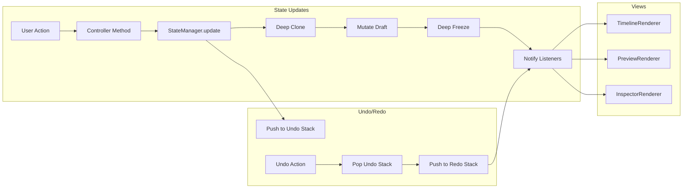

# PicoLume Studio - Software Requirements Document

**Version:** 0.2.1
**Last Updated:** December 2025
**Author:** PicoLume Project
**License:** GNU General Public License v3.0

---

## Table of Contents

1. [Introduction](#1-introduction)
2. [System Overview](#2-system-overview)
3. [Technical Architecture](#3-technical-architecture)
4. [Data Models](#4-data-models)
5. [Functional Requirements](#5-functional-requirements)
6. [User Interface Requirements](#6-user-interface-requirements)
7. [Non-Functional Requirements](#7-non-functional-requirements)
8. [File Formats](#8-file-formats)
9. [Hardware Integration](#9-hardware-integration)
10. [File Interaction Diagrams](#10-file-interaction-diagrams)
11. [Appendices](#11-appendices)

---

## 1. Introduction

### 1.1 Purpose

PicoLume Studio is a desktop application for creating, editing, and managing LED light show sequences. It provides a timeline-based editor for choreographing LED effects synchronized with audio, and can deploy these shows to PicoLume hardware controllers (Raspberry Pi Pico-based devices).

### 1.2 Scope

This document defines the software requirements for PicoLume Studio, including:
- Functional requirements for LED effect creation and editing
- Audio synchronization capabilities
- Project file management
- Hardware upload and communication
- User interface specifications
- Technical architecture details

### 1.3 Target Users

- **Show Designers**: Create light shows for performances, events, or installations
- **Flow Artists**: Design prop shows for poi, staffs, hoops, and other LED props
- **Event Producers**: Manage and deploy light sequences across multiple props
- **Hobbyists**: Create personal LED projects with synchronized audio

### 1.4 Technology Stack

| Component | Technology |
|-----------|------------|
| Backend Framework | Go 1.23 with Wails v2.11.0 |
| Frontend | Vanilla JavaScript (ES Modules) |
| CSS Framework | Tailwind CSS v3.4.1 |
| Build System | Wails CLI |
| Testing | Vitest v4.0.15 |
| Serial Communication | go.bug.st/serial v1.6.4 |

---

## 2. System Overview

### 2.1 Application Description

PicoLume Studio is a Wails-based hybrid desktop application that combines:
- A Go backend for file I/O, serial communication, and binary generation
- A JavaScript frontend for the user interface and timeline editing
- WebView2 for rendering the UI on Windows

### 2.2 Key Features

1. **Timeline Editor**: Multi-track timeline for arranging LED effects and audio
2. **Effect Palette**: 16 built-in LED effects with customizable parameters
3. **Real-time Preview**: Canvas-based simulation of LED output
4. **Audio Synchronization**: Load and sync audio files with visual effects
5. **Project Management**: Save/load projects in `.lum` format (ZIP-based)
6. **Hardware Upload**: Direct upload to Pico devices via USB mass storage
7. **Binary Export**: Generate standalone `.bin` show files

### 2.3 System Context Diagram


---

## 3. Technical Architecture

### 3.1 High-Level Architecture


### 3.2 Component Descriptions

#### 3.2.1 Frontend Components

| Component | File | Description |
|-----------|------|-------------|
| **Application** | `core/Application.js` | Main application bootstrap, initializes all services and controllers |
| **StateManager** | `core/StateManager.js` | Centralized immutable state management with undo/redo support |
| **ErrorHandler** | `core/ErrorHandler.js` | Centralized error handling and toast notifications |
| **Backend Adapter** | `core/Backend.js` | Environment adapter (Wails vs browser demo) for backend-dependent features |
| **Validators** | `core/validators.js` | Input validation functions for colors, times, clips, tracks |
| **AudioService** | `services/AudioService.js` | Web Audio API management, buffer loading, playback control |
| **ProjectService** | `services/ProjectService.js` | Project save/load/new operations via backend |
| **TimelineController** | `controllers/TimelineController.js` | Track/clip CRUD, selection, clipboard operations |
| **UndoController** | `controllers/UndoController.js` | Undo/redo stack management and UI updates |
| **TimelineRenderer** | `views/TimelineRenderer.js` | Renders tracks, clips, ruler, playhead |
| **PreviewRenderer** | `views/PreviewRenderer.js` | Canvas-based LED effect simulation |
| **InspectorRenderer** | `views/InspectorRenderer.js` | Property panel for clips and project settings |
| **timeline.js** | `timeline.js` | Coordination layer between renderers |
| **utils.js** | `utils.js` | Color conversion, time formatting, helpers |

##### Website Demo (Static Frontend)

To keep the marketing site demo aligned with the Studio UI, the project maintains a static web demo build that reuses the same frontend code (ES Modules + compiled Tailwind CSS) but runs without the Go/Wails backend.

- **Output folder (website repo)**: `website/public/studio-demo/` (served as `/studio-demo/` by Astro)
- **Entry URL (website repo)**: `website/public/demo.html` redirects to `/studio-demo/index.html`
- **Sync script (studio repo)**: `scripts/sync-studio-demo.mjs` copies `studio/frontend/` into the website repo's `website/public/studio-demo/` and strips Wails-only pieces (ex: `/wailsjs/runtime/runtime.js`)
- **Demo detection**: the frontend checks for `window.go.main.App`; if absent, it uses the demo backend adapter (`core/Backend.js`)
  - Save/Load are supported via browser file pickers and use standard `.lum` files compatible with the desktop app
  - Export/Upload remain disabled in the web demo
- **CI/CD (website repo)**: the website repo can build and deploy automatically (e.g. GitHub Actions -> Hostinger via FTP) by building the Astro site and deploying `dist/`. In this model, `website/public/studio-demo/` is treated as a committed static asset that is updated by the sync script during development.

#### 3.2.2 Backend Components

| Component | File | Description |
|-----------|------|-------------|
| **App** | `app.go` | Application struct with all exposed methods |
| **Main** | `main.go` | Wails initialization and window configuration |

### 3.3 State Management Architecture



---

## 4. Data Models

### 4.1 Project Structure


### 4.2 Application State

```javascript
{
    project: {
        version: '0.2.1',
        name: "My Show",
        duration: 60000,  // milliseconds
        settings: {
            profiles: [...],
            patch: {},        // prop ID -> profile ID mapping (computed from assignedIds)
            fieldLayout: {}   // prop ID -> { x, y } positions for field preview
        },
        propGroups: [...],
        tracks: [...]
    },
    assets: {},           // bufferId -> AudioBuffer
    audioLibrary: {},     // bufferId -> data URL
    activeAudioSources: [],
    selection: [],        // selected clip IDs
    filePath: null,       // current project file path
    isDirty: false,       // unsaved changes flag
    autoSaveEnabled: true,
    playback: {
        isPlaying: false,
        currentTime: 0,   // milliseconds
        startTime: 0      // audio context reference time
    },
    ui: {
        zoom: 50,         // pixels per second
        snapEnabled: true,
        gridSize: 1000,   // snap grid in ms
        previewMode: 'track' // 'track' | 'field' | 'off'
    },
    audio: {
        ctx: null,        // AudioContext
        masterGain: null, // GainNode
        masterVolume: 1.0
    },
    clipboard: null,
    lastPreviewRender: 0
}
```

### 4.3 Track Types

| Type | Description | Associated Clips |
|------|-------------|------------------|
| `led` | LED effect track | All effect clips (solid, flash, etc.) |
| `audio` | Audio track | Audio clips with bufferId reference |

### 4.4 Effect Types

| Effect | Description | Parameters |
|--------|-------------|------------|
| `solid` | Static single color | `color` |
| `flash` | Quick white burst (camera flash) | `color` |
| `strobe` | Rapid on/off flashing | `color`, `rate` |
| `rainbow` | Moving hue gradient | `speed`, `frequency` |
| `rainbowHold` | Static rainbow gradient | `frequency` |
| `chase` | Moving colored segment | `color`, `speed`, `width` |
| `wipe` | Linear color fill | `color` |
| `scanner` | Bouncing "larson scanner" | `color`, `speed`, `width` |
| `meteor` | Trailing projectile | `color`, `speed`, `tailLen` |
| `fire` | Randomized fire simulation | (none) |
| `sparkle` | Random glitter effect | `color`, `density` |
| `glitch` | Digital interference | `color`, `color2`, `amount` |
| `breathe` | Slow pulse in/out | `color`, `speed` |
| `heartbeat` | Double-pulse rhythm | `color`, `speed` |
| `alternate` | Alternating A/B pattern | `colorA`, `colorB` |
| `energy` | Flowing plasma wave | `color`, `color2`, `speed` |

---

## 5. Functional Requirements

### 5.1 Project Management

#### FR-PM-001: Create New Project
- **Description**: User can create a new empty project
- **Trigger**: Click "New" button or Ctrl+N
- **Preconditions**: None
- **Flow**:
  1. If unsaved changes exist, prompt for confirmation
  2. Clear all audio buffers
  3. Reset state to initial defaults
  4. Clear undo/redo history
- **Postconditions**: Fresh project with default tracks

#### FR-PM-002: Save Project
- **Description**: User can save project to disk
- **Trigger**: Click "Save" button or Ctrl+S
- **Preconditions**: None
- **Flow**:
  1. If no file path set, prompt for save location
  2. Serialize project data to JSON
  3. Package audio files as base64
  4. Create ZIP archive with `.lum` extension
- **Postconditions**: Project saved, dirty flag cleared

#### FR-PM-003: Save Project As
- **Description**: User can save project to new location
- **Trigger**: Click "Save As" button
- **Preconditions**: None
- **Flow**:
  1. Always prompt for save location
  2. Continue as FR-PM-002
- **Postconditions**: Project saved to new path

#### FR-PM-004: Open Project
- **Description**: User can load existing project
- **Trigger**: Click "Open" button
- **Preconditions**: None
- **Flow**:
  1. Show file open dialog (*.lum filter)
  2. Extract ZIP contents
  3. Parse project.json
  4. Load audio files from archive
  5. Replace application state
- **Postconditions**: Project loaded, UI updated

### 5.2 Timeline Editing

#### FR-TL-001: Add Track
- **Description**: User can add new LED or audio tracks
- **Trigger**: Click "LED Track" or "Audio Track" button
- **Preconditions**: None
- **Flow**:
  1. Create track with unique ID
  2. Set default label based on type
  3. Append to tracks array
- **Postconditions**: New track visible in timeline

#### FR-TL-002: Delete Track
- **Description**: User can remove a track
- **Trigger**: Click trash icon on track header
- **Preconditions**: Track exists
- **Flow**:
  1. Confirm deletion
  2. Remove track from project
  3. Remove any clips in selection
- **Postconditions**: Track removed from timeline

#### FR-TL-003: Reorder Tracks
- **Description**: User can drag tracks to reorder
- **Trigger**: Drag track header
- **Preconditions**: At least 2 tracks exist
- **Flow**:
  1. Drag track header to new position
  2. Visual indicator shows drop position
  3. Reorder tracks array on drop
- **Postconditions**: Tracks in new order

#### FR-TL-004: Add Clip (Drag & Drop)
- **Description**: User can add effects by dragging from palette
- **Trigger**: Drag palette item to track
- **Preconditions**: Compatible track type
- **Flow**:
  1. Detect drop position and track
  2. Calculate start time from X position
  3. Apply snap if enabled
  4. Check for overlaps, adjust if needed
  5. Create clip with default properties
- **Postconditions**: New clip on track

#### FR-TL-005: Select Clips
- **Description**: User can select one or more clips
- **Trigger**: Click on clip
- **Preconditions**: Clip exists
- **Flow**:
  - Single click: Replace selection
  - Ctrl+click: Toggle in selection
- **Postconditions**: Selection updated, inspector shows properties

#### FR-TL-006: Move Clips
- **Description**: User can drag clips to new position/track
- **Trigger**: Drag clip
- **Preconditions**: Clip selected
- **Flow**:
  1. Track mouse movement
  2. Update visual position in real-time
  3. Apply snap if enabled
  4. Allow cross-track move (same type only)
  5. Commit position on mouse up
- **Postconditions**: Clip(s) at new position

#### FR-TL-007: Resize Clips
- **Description**: User can resize clips by dragging edges
- **Trigger**: Drag clip handle (left or right edge)
- **Preconditions**: Clip selected
- **Flow**:
  1. Determine resize direction (left/right)
  2. Update width/position during drag
  3. Enforce minimum duration
  4. Apply snap if enabled
- **Postconditions**: Clip duration/start updated

#### FR-TL-008: Delete Clips
- **Description**: User can delete selected clips
- **Trigger**: Press Delete/Backspace
- **Preconditions**: Selection not empty
- **Flow**:
  1. Remove clips from tracks
  2. Clear selection
- **Postconditions**: Clips removed

#### FR-TL-009: Copy/Paste Clips
- **Description**: User can copy and paste clips
- **Trigger**: Ctrl+C / Ctrl+V
- **Preconditions**: Clips selected (for copy)
- **Flow**:
  - Copy: Store clips in clipboard with track type
  - Paste: Create new clips at end of appropriate tracks
- **Postconditions**: Clips duplicated

#### FR-TL-010: Duplicate Clips
- **Description**: User can duplicate selected clips
- **Trigger**: Ctrl+D
- **Preconditions**: Clips selected
- **Flow**:
  1. Clone each selected clip
  2. Place copies immediately after originals
- **Postconditions**: Duplicate clips created

### 5.3 Audio Management

#### FR-AU-001: Load Audio File
- **Description**: User can load audio into audio track
- **Trigger**: Drop file or click upload icon
- **Preconditions**: Audio track exists
- **Flow**:
  1. Read file as ArrayBuffer
  2. Create blob and data URL
  3. Decode audio data
  4. Store buffer and reference
  5. Create audio clip on track
- **Postconditions**: Audio clip created with waveform

#### FR-AU-002: Audio Playback
- **Description**: User can play/pause audio with timeline
- **Trigger**: Click Play button or Space
- **Preconditions**: Audio context initialized
- **Flow**:
  1. Resume audio context if suspended
  2. Calculate offset from current time
  3. Schedule all audio clips
  4. Start animation loop for UI updates
- **Postconditions**: Audio playing, playhead moving

#### FR-AU-003: Volume Control
- **Description**: User can adjust master and clip volume
- **Trigger**: Adjust volume slider
- **Preconditions**: Audio context exists
- **Flow**:
  1. Update gain node value
  2. Store volume in state
- **Postconditions**: Volume adjusted

### 5.4 Preview

#### FR-PV-001: Real-time Preview
- **Description**: Canvas shows simulated LED output
- **Trigger**: Playback or scrubbing
- **Preconditions**: LED tracks exist
- **Flow**:
  1. Throttle to ~60fps during playback
  2. Clear canvas
  3. For each LED track, render LED row
  4. Calculate active clips at current time
  5. Apply effect algorithm for each LED
- **Postconditions**: Canvas shows current state

### 5.5 Export & Upload

#### FR-EX-001: Export Binary
- **Description**: User can export show as .bin file
- **Trigger**: Click "Export" button
- **Preconditions**: Project has LED clips
- **Flow**:
  1. Generate binary format (V3 with PropConfig LUT)
  2. Prompt for save location
  3. Write file to disk
- **Postconditions**: Binary file saved

#### FR-EX-002: Upload to Device
- **Description**: User can upload directly to Pico
- **Trigger**: Click "Upload" button
- **Preconditions**: Receiver is connected in USB upload/config mode (mass storage mounted)
- **Flow**:
  1. Generate binary
  2. Detect Pico drive (skip bootloader mode)
  3. Write show.bin to device
  4. Wait for filesystem sync
  5. Send reset command via serial (`r`) to reload the device
  6. If reset cannot be confirmed, prompt user to manually “Safely Eject” the drive before unplugging
- **Postconditions**: Show loaded on device

### 5.6 Undo/Redo

#### FR-UR-001: Undo
- **Description**: Revert last change
- **Trigger**: Ctrl+Z or Undo button
- **Preconditions**: Undo stack not empty
- **Flow**:
  1. Pop previous state from undo stack
  2. Push current state to redo stack
  3. Replace current state
  4. Notify listeners
- **Postconditions**: State reverted

#### FR-UR-002: Redo
- **Description**: Re-apply undone change
- **Trigger**: Ctrl+Shift+Z or Redo button
- **Preconditions**: Redo stack not empty
- **Flow**: Inverse of undo
- **Postconditions**: State restored

---

## 6. User Interface Requirements

### 6.1 Layout Structure


### 6.2 UI Regions

#### 6.2.1 Header Bar
- Application branding (PicoLume Studio)
- Undo/Redo buttons
- Transport controls (Play, Stop, To Start)
- Volume slider
- Time display (MM:SS.ss format)
- Project buttons (Upload, Export, New, Save, Save As, Open)
- Layout toggle buttons (Palette, Preview, Inspector)
- Settings and Manual buttons
- Hamburger menu (consolidated access to all actions)

#### 6.2.2 Effect Palette (Collapsible)
- Title: "Effect Palette"
- 16 draggable effect items
- Each item shows:
  - Color indicator
  - Effect name
  - Brief description

#### 6.2.3 Preview Pane (Collapsible)
- Canvas element (800x200)
- Real-time LED simulation
- Label: "Simulated Preview"

#### 6.2.4 Timeline Toolbar
- Add Track buttons (LED, Audio)
- Clipboard buttons (Copy, Paste, Duplicate)
- Snap toggle with magnet icon
- Grid size selector (1s, 1/2s, 1/4s, 1/8s)
- Zoom slider (10-200 px/s)

#### 6.2.5 Timeline Editor
- **Track Headers** (left, 240px):
  - Icon (lightbulb/music)
  - Editable label
  - Prop group selector (LED tracks)
  - Delete button
  - Drag handle for reordering

- **Timeline Content** (right, scrollable):
  - Time ruler with tick marks
  - Playhead (vertical red line with handle)
  - Track lanes with clips
  - Grid background (when snap enabled)

#### 6.2.6 Inspector Panel (Collapsible)
- **No Selection**: Project settings
  - Project name, duration
  - Auto-save toggle
  - Hardware profiles (per-prop configuration: LED type/order/brightness cap + assigned prop IDs)
  - Prop groups

- **Single Clip**: Clip properties
  - Start time, duration
  - Effect-specific parameters
  - Delete button

- **Multiple Clips**: Batch operations
  - Selection count
  - Delete Selected button

#### 6.2.7 Status Bar
- History indicator (undo count)
- Keyboard shortcut hints
- Pico connection indicator (e.g., Not detected / Bootloader / USB drive / Serial COM port)

#### 6.2.8 Hamburger Menu
A dropdown menu accessible via the hamburger icon (three horizontal lines) in the header bar. Provides consolidated access to all major application actions with keyboard shortcut hints.

**Menu Items:**
| Item | Icon | Shortcut | Action |
|------|------|----------|--------|
| New Project | `fa-file` | Ctrl+N | Create new project |
| Open Project | `fa-folder-open` | Ctrl+O | Open existing project |
| Save | `fa-save` | Ctrl+S | Save current project |
| Save As... | `fa-file-export` | Ctrl+Shift+S | Save to new location |
| Export Binary | `fa-download` | - | Export .bin file |
| Upload to Device | `fa-microchip` | - | Upload to Pico |
| Themes (submenu) | `fa-palette` | - | Select application theme |
| Project Settings | `fa-cog` | - | Open settings in inspector |
| User Manual | `fa-book` | - | Open manual modal |

**Behavior:**
- Opens on hamburger button click
- Closes when clicking outside the menu
- Closes when pressing Escape key
- Closes after selecting a menu item
- Themes opens a submenu on hover/focus and applies immediately
- Animated slide-down transition (150ms)
- Menu items highlight on hover with accent color on icons

**Styling:**
- Theme-controlled background and borders
- 220px minimum width
- Rounded corners (8px)
- Drop shadow for depth
- Keyboard shortcuts displayed in subtle badge style

### 6.3 Keyboard Shortcuts

#### Global Shortcuts

| Shortcut | Action |
|----------|--------|
| Space | Play/Pause |
| Ctrl+N | New Project |
| Ctrl+O | Open Project |
| Ctrl+S | Save |
| Ctrl+Shift+S | Save As |
| Ctrl+Z | Undo |
| Ctrl+Shift+Z | Redo |
| Ctrl+C | Copy |
| Ctrl+V | Paste |
| Ctrl+D | Duplicate |
| Delete/Backspace | Delete selected |
| Alt+1 | Toggle Palette |
| Alt+2 | Toggle Preview |
| Alt+3 | Toggle Inspector |
| Escape | Close modal/menu, clear selection |

#### Timeline Clip Navigation (Accessibility)

| Shortcut | Action |
|----------|--------|
| Tab | Navigate to next clip |
| Shift+Tab | Navigate to previous clip |
| Arrow Up/Down | Navigate to clip in adjacent track |
| Arrow Left/Right | Nudge selected clips earlier/later |
| Shift+Arrow Left | Shrink clip duration |
| Shift+Arrow Right | Grow clip duration |
| Enter/Space (on clip) | Select/toggle clip |
| Ctrl+Enter (on clip) | Add clip to multi-selection |

**Notes:**
- Clips are focusable with `tabindex="0"` and include ARIA attributes
- Arrow key nudge respects snap grid when enabled
- Focus indicators use cyan accent color with glow effect

### 6.4 Visual Theming

- **Theme System**: User-selectable themes (Standard/Daylight/Lilac/Rose/Latte/Aurora/Nord/Solarized/Gruvbox/High Contrast/Crimson/Graphite/Forest)
- **Default Theme**: Standard (when no preference is saved)
- **Persistence**: Theme selection is remembered between launches
- **Light/Dark Toggle**: Header toggle (Alt+T) switches between last-used light theme and last-used dark theme
- **Accent Color**: Theme-dependent highlight color (e.g., cyan in Standard)
- **LED Track Color**: Cyan accents
- **Audio Track Color**: Orange accents
- **Font**: System sans-serif, monospace for time displays
- **Icons**: Font Awesome 6

---

## 7. Non-Functional Requirements

### 7.1 Performance

| Requirement | Target |
|-------------|--------|
| Preview frame rate | 60 fps |
| Timeline render time | <100ms |
| Maximum tracks | 50+ |
| Maximum clips per track | 1000+ |
| Undo history limit | 50 states |
| Audio buffer decode time | <2s for 5min file |

### 7.2 Compatibility

| Platform | Requirement |
|----------|-------------|
| Windows | Windows 10+ (WebView2 required) |
| macOS | Planned (Wails supported) |
| Linux | Planned (Wails supported) |
| Pico Hardware | RP2040-based with USB mass storage |

### 7.3 Reliability

- Auto-save capability (configurable)
- Unsaved changes warning on exit
- Error logging with 50-entry buffer
- Graceful handling of audio decode failures
- Toast notifications for user feedback

#### 7.3.1 Async Operation Handling

All async operations in the audio service include timeout and retry logic to prevent hangs and improve reliability:

| Timeout | Value | Description |
|---------|-------|-------------|
| **CONTEXT_RESUME** | 5,000 ms | Audio context resume |
| **FILE_READ** | 30,000 ms | Reading file to array buffer |
| **AUDIO_DECODE** | 60,000 ms | Decoding audio data |
| **FETCH** | 30,000 ms | Fetch operations |
| **BLOB_READ** | 30,000 ms | Blob to data URL conversion |

**Retry Logic** (exponential backoff with jitter):
- `loadAudioFile()`: Up to 2 retries for audio decode (not for format errors)
- `loadAudioFromDataURL()`: Up to 3 retries for fetch, 2 retries for decode
- Retry only on transient failures (timeouts, network errors), not on invalid data

**Implementation** (`AudioService.js`):
```javascript
// Utility functions
withTimeout(promise, timeoutMs, errorMessage)  // Wraps promise with timeout
withRetry(fn, { maxRetries, baseDelayMs, maxDelayMs, shouldRetry })  // Retry with backoff
```

### 7.4 Usability

- Responsive layout with collapsible panels
- Drag-and-drop for intuitive editing
- Real-time visual feedback during operations
- Keyboard shortcuts for power users
- In-app user manual

### 7.5 Security

#### 7.5.1 Path Validation

All file write operations validate paths to prevent directory traversal attacks:

| Validation | Description |
|------------|-------------|
| **Path Cleaning** | `filepath.Clean()` normalizes paths, resolving `.` and `..` components |
| **Absolute Paths** | Only absolute paths are accepted for write operations |
| **Extension Validation** | File extensions are validated against allowed lists (`.lum` for projects) |
| **Traversal Detection** | Paths containing `..` after cleaning are rejected |

**Implementation** (`app.go`):

```go
func validateSavePath(path string, allowedExtensions []string) (string, error)
```

**Protected Functions**:
- `SaveProjectToPath()` - Validates path has `.lum` extension
- `SaveBinary()` - Uses native file dialog (user-controlled)
- `UploadToPico()` - Constructs paths internally (no user input)

#### 7.5.2 Input Validation

Frontend validation helpers (`core/validators.js`) cover:
- Hex color format validation
- Time value bounds checking
- ID string format validation
- Clip and track structure validation

Hardware profile inputs are additionally clamped to valid ranges when edited in the Inspector (`StateManager.clampProfileValue()`), including LED count (1-1000), brightness cap (0-255), and enum fields (LED type / color order).

Backend validation (`app.go`) during binary generation:
- **Color parsing**: Invalid hex colors logged and default to black (0x000000)
- **Prop ID parsing**: Invalid IDs logged and skipped
- **Range validation**: Malformed ranges (missing parts, non-numeric, start > end) logged and skipped
- **Bounds checking**: Prop IDs outside valid range (1-224) are silently ignored

All parse errors are logged with `fmt.Printf("Warning: ...")` for debugging.

#### 7.5.3 File Size Limits

All file loading operations enforce size limits to prevent denial-of-service attacks:

| Limit | Value | Description |
|-------|-------|-------------|
| **MaxZipFileSize** | 500 MB | Maximum size of a `.lum` project file |
| **MaxProjectJsonSize** | 10 MB | Maximum size of `project.json` within archive |
| **MaxAudioFileSize** | 200 MB | Maximum size of a single audio file |
| **MaxTotalExtractedSize** | 1 GB | Maximum total size of all extracted files |
| **MaxFilesInZip** | 100 | Maximum number of files in archive |

**Implementation** (`app.go`):
- Zip file size checked before opening
- File count validated to prevent zip bombs
- Individual file sizes checked against `UncompressedSize64` before extraction
- `io.LimitReader` used during extraction as defense-in-depth
- Total extracted size tracked and enforced
- Only known file types (`project.json`, `audio/*`) are processed

---

## 8. File Formats

### 8.1 Project File (.lum)

The `.lum` file is a ZIP archive containing:

```
myshow.lum
├── project.json          # Project data (JSON)
└── audio/
    ├── audio_123456.mp3  # Audio files (base64 decoded)
    └── audio_789012.wav
```

#### project.json Structure

```json
{
  "version": "0.2.1",
  "name": "My Show",
  "duration": 60000,
  "settings": {
    "profiles": [
      {
        "id": "p_default",
        "name": "Standard Prop",
        "assignedIds": "1-224",
        "ledCount": 164,
        "ledType": 0,
        "colorOrder": 0,
        "brightnessCap": 255,
        "voltage": 5,
        "physicalLength": null,
        "pixelsPerMeter": 60,
        "notes": ""
      }
    ],
    "patch": { "1": "p_default" },
    "fieldLayout": {}
  },
  "propGroups": [
    { "id": "g_all", "name": "All Props", "ids": "1-18" }
  ],
  "tracks": [
    {
      "id": "t1",
      "type": "audio",
      "label": "Music",
      "clips": [
        {
          "id": "c1",
          "type": "audio",
          "startTime": 0,
          "duration": 30000,
          "bufferId": "audio_123456",
          "props": { "name": "song.mp3", "volume": 1.0 }
        }
      ]
    },
    {
      "id": "t2",
      "type": "led",
      "label": "Main",
      "groupId": "g_all",
      "clips": [
        {
          "id": "c2",
          "type": "solid",
          "startTime": 0,
          "duration": 5000,
          "props": { "color": "#ff0000" }
        }
      ]
    }
  ]
}
```

### 8.2 Binary Show File (.bin)

The binary format (V3) is structured for efficient parsing on the Pico and includes a per-prop `PropConfig` look-up table (LUT) derived from Hardware Profiles.

```
+------------------+--------+--------------------------------+
| Offset           | Size   | Description                    |
+------------------+--------+--------------------------------+
| 0x0000           | 4      | Magic: 0x5049434F ("PICO")     |
| 0x0004           | 2      | Version: 3                     |
| 0x0006           | 2      | Event count                    |
| 0x0008           | 8      | Reserved                       |
| 0x0010           | 1792   | PropConfig LUT (224 x 8 bytes) |
| 0x0710           | N*48   | Events (48 bytes each)         |
+------------------+--------+--------------------------------+

PropConfig LUT Entry (8 bytes each, 1-indexed by prop ID):
+--------+--------+-------------------------------------------+
| Offset | Size   | Description                               |
+--------+--------+-------------------------------------------+
| 0x00   | 2      | LED count                                 |
| 0x02   | 1      | LED type (chipset enum)                   |
| 0x03   | 1      | Color order enum                           |
| 0x04   | 1      | Brightness cap (0-255)                    |
| 0x05   | 3      | Reserved                                  |
+--------+--------+-------------------------------------------+

Event Structure (48 bytes):
+--------+--------+--------------------------------+
| Offset | Size   | Description                    |
+--------+--------+--------------------------------+
| 0x00   | 4      | Start time (ms)                |
| 0x04   | 4      | Duration (ms)                  |
| 0x08   | 1      | Effect code                    |
| 0x09   | 3      | Padding                        |
| 0x0C   | 4      | Color (RGB)                    |
| 0x10   | 4      | Color2 (RGB)                   |
| 0x14   | 28     | Prop mask (7 x uint32)         |
+--------+--------+--------------------------------+
```

#### Effect Codes

| Code | Effect |
|------|--------|
| 1 | solid |
| 2 | flash |
| 3 | strobe |
| 4 | rainbow |
| 5 | rainbowHold |
| 6 | chase |
| 9 | wipe |
| 10 | scanner |
| 11 | meteor |
| 12 | fire |
| 13 | heartbeat |
| 14 | glitch |
| 15 | energy |
| 16 | sparkle |
| 17 | breathe |
| 18 | alternate |

---

## 9. Hardware Integration

### 9.1 Device Detection

PicoLume Studio detects Pico devices by:
1. Scanning drives C-Z
2. Skipping bootloader mode (INFO_UF2.TXT present)
3. Looking for INDEX.HTM or show.bin

### 9.2 Serial Communication

| Parameter | Value |
|-----------|-------|
| Baud Rate | 115200 |
| USB VID | 0x2E8A (Raspberry Pi), 0x239A (Adafruit), or 0x1B4F (SparkFun) |
| Reset Command | 'r' (single byte) |

### 9.3 Upload Sequence


**Note:** On Windows, programmatic USB eject is not reliable across all RP2040 boards. Studio prefers serial reset and prompts the user to Safely Eject if auto-reload cannot be confirmed.

---

## 10. File Interaction Diagrams

### 10.1 Complete System Architecture


### 10.2 Frontend Module Dependencies


### 10.3 State Flow


### 10.4 Event Communication


### 10.5 Backend API (Wails Bindings)


---

## 11. Appendices

### 11.1 Glossary

| Term | Definition |
|------|------------|
| **Clip** | A single effect instance on the timeline with start time, duration, and properties |
| **Track** | A horizontal row in the timeline that contains clips of the same type |
| **Prop** | An individual LED device (up to 224 supported) |
| **Prop Group** | A named collection of prop IDs for batch targeting |
| **Hardware Profile** | LED count configuration for a specific prop type |
| **Patch** | Mapping of prop IDs to hardware profiles |
| **LUT** | Look-Up Table in binary format for per-prop LED counts |

### 11.2 Configuration Constants

```javascript
// From utils.js
const CONFIG = {
    defaultDuration: 3000,    // Default clip duration (ms)
    minClipDuration: 100,     // Minimum clip duration (ms)
    magnetThreshold: 200,     // Snap threshold (unused)
    headerWidth: 240,         // Track header width (px)
    maxUndoStack: 50,         // Maximum undo history
    previewThrottleMs: 16,    // ~60fps preview
    ledsPerTrack: 55          // LEDs shown in preview
};
```

### 11.3 Binary Format Constants

```go
// From app.go
const TOTAL_PROPS = 224
const MASK_ARRAY_SIZE = 7  // 224 / 32 = 7 uint32s
```

### 11.4 File Structure Reference

```
picolume/studio/
├── main.go                 # Wails entry point
├── app.go                  # Backend methods
├── go.mod                  # Go dependencies
├── go.sum                  # Dependency checksums
├── wails.json              # Wails configuration
├── frontend/
│   ├── index.html          # Main HTML
│   ├── manual.html         # User manual
│   ├── package.json        # npm dependencies
│   ├── tailwind.config.js  # Tailwind configuration
│   └── src/
│       ├── main.js                    # Application entry
│       ├── timeline.js                # Timeline coordination
│       ├── utils.js                   # Utility functions
│       ├── audio.js                   # (Legacy/unused)
│       ├── input.css                  # Tailwind input
│       ├── style.css                  # Compiled CSS
│       ├── core/
│       │   ├── Application.js         # App bootstrap
│       │   ├── StateManager.js        # State management
│       │   ├── ErrorHandler.js        # Error handling
│       │   └── validators.js          # Validation
│       ├── services/
│       │   ├── AudioService.js        # Audio management
│       │   └── ProjectService.js      # Project I/O
│       ├── controllers/
│       │   ├── TimelineController.js  # Timeline ops
│       │   └── UndoController.js      # Undo/redo
│       ├── views/
│       │   ├── TimelineRenderer.js    # Timeline UI
│       │   ├── PreviewRenderer.js     # LED preview
│       │   └── InspectorRenderer.js   # Properties
│       ├── wailsjs/                   # Auto-generated bindings
│       ├── assets/                    # Static assets
│       └── __tests__/                 # Test files
└── build/                             # Build output
```

### 11.5 Version History

| Version | Date | Changes |
|---------|------|---------|
| 0.1.0 | Dec 2025 | Initial alpha release |
| 0.1.1 | Dec 2025 | Added hamburger menu for consolidated action access |
| 0.1.2 | Dec 2025 | Added Section 7.5 Security: Path validation to prevent directory traversal attacks |
| 0.1.3 | Dec 2025 | Added file size limits on zip loading to prevent DoS attacks |
| 0.1.4 | Dec 2025 | Replaced silent error ignoring with proper error handling in binary generation |
| 0.1.5 | Dec 2025 | Added keyboard navigation for timeline clips (Tab, Arrow keys, Enter/Space) |
| 0.1.6 | Dec 2025 | Added retry/timeout logic for async audio operations (AudioService.js) |
| 0.2.0 | Dec 2025 | Added theme system + website demo workflow; web demo supports `.lum` Save/Load (incl. embedded audio) |
| 0.2.1 | Dec 2025 | Added light themes (Daylight/Lilac/Rose/Latte) + header light/dark toggle; added About modal; improved preview refresh on project load; added footer status widget; added inspector sliders for numeric props |
| 0.2.2 | Dec 2025 | Improved upload reliability: firmware filesystem cleanup on reset, show.bin load retry logic |
| 0.2.3 | Dec 2025 | Upload reload via serial reset + manual safe-eject fallback; status bar Pico connection indicator; improved Pico-family serial VID detection |
| 0.2.3 | Dec 2025 | Added drag-and-drop reordering for color palette cards in Inspector (matches hardware profiles and prop groups behavior) |
| 0.2.3 | Dec 2025 | Fixed drop indicator line being clipped during drag operations (uses inset box-shadow to avoid parent overflow clipping) |

---

**Document End**
