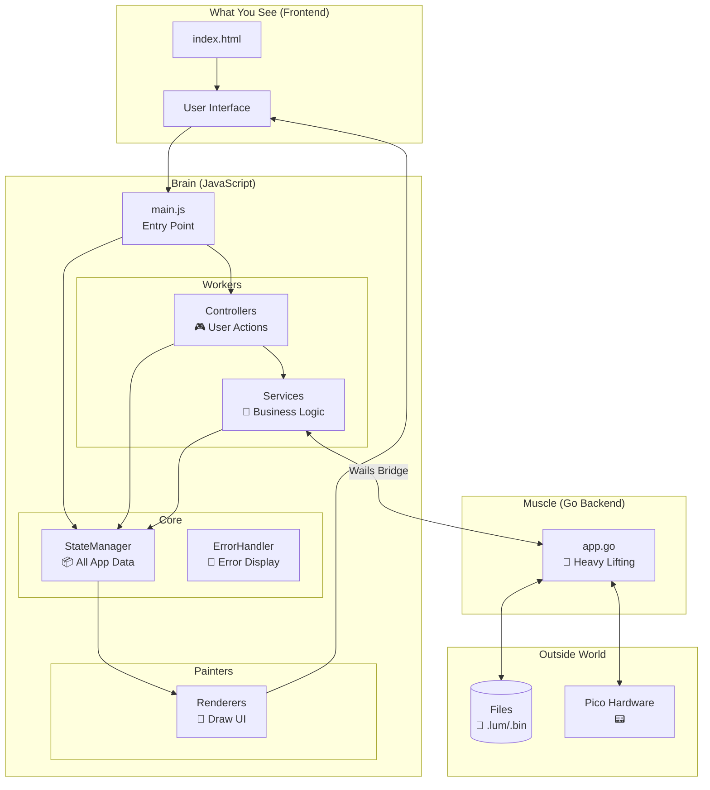
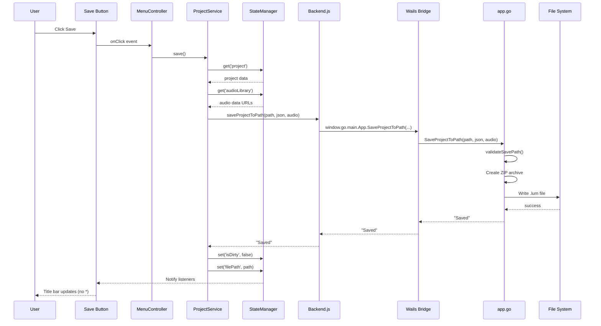
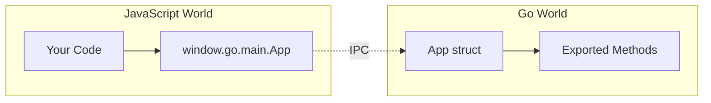
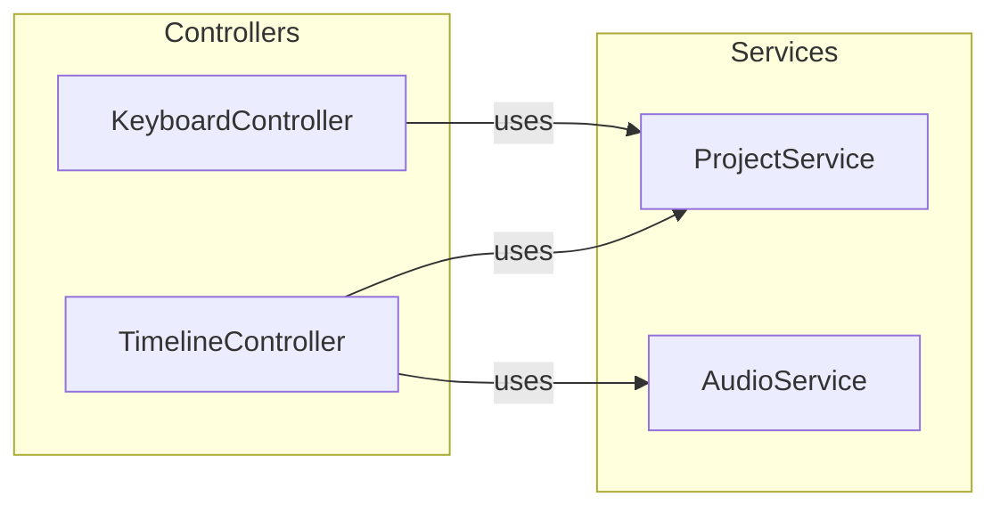
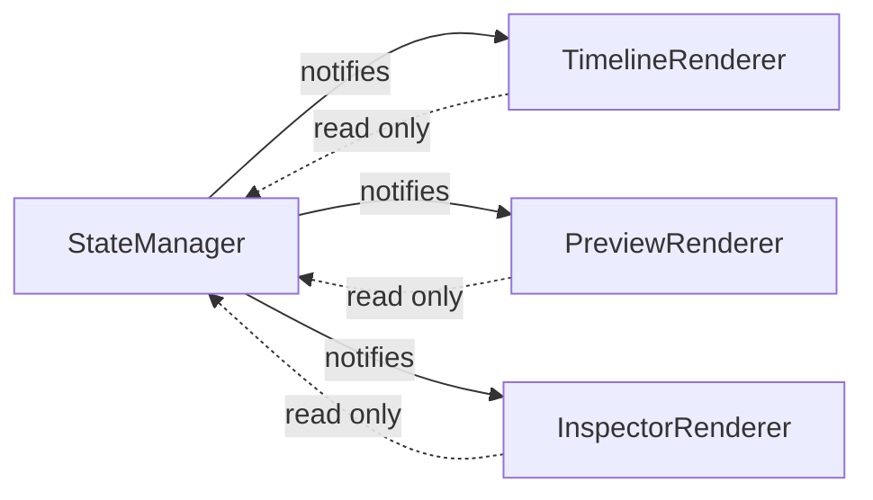

# Architecture Overview

This document provides a 30,000-foot view of how all the pieces of PicoLume Studio connect.

---

## Component Analogy

PicoLume Studio follows a restaurant-like separation of concerns:

| Restaurant | PicoLume Studio |
|------------|-----------------|
| **Dining Room** (what customers see) | **Frontend** (HTML/CSS/JS UI) |
| **Waiters** (take orders, deliver food) | **Controllers** (handle user interactions) |
| **Kitchen** (prepares food) | **Services** (business logic) |
| **Pantry** (stores ingredients) | **StateManager** (stores all data) |
| **Back Office** (ordering supplies, managing staff) | **Go Backend** (file I/O, hardware) |
| **Delivery Truck** (brings supplies) | **Wails Bridge** (connects JS to Go) |

Just like a restaurant has clear separation of concerns (waiters don't cook, chefs don't seat guests), the app has clear boundaries between components.

---

## High-Level Architecture



### Key Insight: StateManager is Central

Notice how StateManager is at the center of everything. This is intentional. **All application data lives in one place**, and everything else either:
- **Reads** from it (Renderers)
- **Writes** to it (Controllers, Services)
- **Reacts** to changes in it (everyone subscribes)

This pattern is called **Single Source of Truth** and prevents bugs where "the UI shows one thing but the data says another."

---

## File Structure

```
studio/
├── main.go                     # 🚀 App starts here (Go side)
├── app.go                      # 💪 All backend logic
│
└── frontend/
    ├── index.html              # 📄 The one HTML file
    │
    └── src/
        ├── main.js             # 🚀 App starts here (JS side)
        │
        ├── core/               # 🧠 The "brain"
        │   ├── Application.js  #    Boots everything up
        │   ├── StateManager.js #    📦 THE source of truth
        │   ├── Backend.js      #    🌉 Wails adapter
        │   └── ErrorHandler.js #    🚨 Toast notifications
        │
        ├── services/           # 🔧 Business logic
        │   ├── AudioService.js #    🔊 Sound handling
        │   └── ProjectService.js#   💾 Save/Load
        │
        ├── controllers/        # 🎮 User action handlers
        │   ├── TimelineController.js
        │   ├── UndoController.js
        │   ├── KeyboardController.js
        │   ├── MenuController.js
        │   └── ThemeManager.js
        │
        └── views/              # 🎨 Canvas/DOM rendering
            ├── TimelineRenderer.js
            ├── PreviewRenderer.js
            └── InspectorRenderer.js
```

### Naming Convention

The suffixes tell you what a file does:

| Suffix | Role | Talks To |
|--------|------|----------|
| `*Service.js` | Does work, manages data | StateManager, Backend |
| `*Controller.js` | Handles user actions | Services, StateManager |
| `*Renderer.js` | Draws to screen | StateManager (read-only) |
| `*Manager.js` | Manages a specific concern | Various |

---

## Data Flow Example: Save Operation

Here's what happens when you click "Save":



### Key Observations

1. **Clear chain of command** - Each layer only talks to its neighbors
2. **State is always updated** - After save, we update `isDirty` and `filePath`
3. **Security happens in Go** - Path validation is backend responsibility
4. **UI reacts automatically** - State change triggers UI update

---

## Technology Stack

### Why Wails?

**The Problem:** We need a desktop app that:
- Works on Windows, Mac, Linux
- Has a rich, modern UI
- Can access the file system and USB ports
- Doesn't require users to install a browser

**The Options:**

| Option | Pros | Cons |
|--------|------|------|
| **Electron** | Huge ecosystem | 100MB+ app size, resource hog |
| **Qt/GTK** | Native performance | Complex, different code per platform |
| **Tauri** | Small, Rust-powered | Rust learning curve |
| **Wails** | Small, Go-powered, web UI | Smaller ecosystem |

**Why Wails Won:**
- Go is simpler than Rust (for our needs)
- Web UI means we know HTML/CSS/JS
- ~10MB app size vs 100MB+ for Electron
- WebView2 on Windows = native performance

### Why Vanilla JavaScript?

| Framework | Bundle Size | Learning Curve | Our Need |
|-----------|-------------|----------------|----------|
| React | ~40KB | Medium | Virtual DOM, component model |
| Vue | ~30KB | Low | Reactivity, templates |
| Svelte | ~2KB | Low | Compiled reactivity |
| **Vanilla** | 0KB | None | Full control |

For PicoLume Studio:
- We have one "page" (not a multi-page app)
- We need fine-grained canvas control (timeline, preview)
- StateManager gives us the reactivity we need
- No build step complexity

We essentially built a mini-framework with StateManager + custom events.

---

## The Three Boundaries

Understanding these boundaries is crucial:

### Boundary 1: JavaScript ↔ Go (Wails Bridge)



**Rules:**
- Only Go methods on the `App` struct are callable
- Methods must be exported (capital letter)
- Parameters are JSON-serialized
- Returns are JSON-deserialized

### Boundary 2: Services ↔ Controllers



**Rules:**
- Controllers handle user input
- Services handle business logic
- Controllers call services, not vice versa
- Both read/write StateManager

### Boundary 3: State ↔ Views



**Rules:**
- Views only READ state
- Views NEVER write state directly
- Views subscribe to state changes
- Changes trigger re-renders

---

## Mental Model: The Assembly Line

Think of the app as an assembly line:

```
┌─────────────────────────────────────────────────────────────────┐
│                        ASSEMBLY LINE                             │
├─────────────────────────────────────────────────────────────────┤
│                                                                  │
│  [User Input] → [Controller] → [Service] → [State] → [View]     │
│       │              │             │           │          │      │
│    click,         validate,     do work,    store,    render    │
│    type,          route,        call Go,    notify    to DOM    │
│    drag           dispatch      transform             canvas    │
│                                                                  │
└─────────────────────────────────────────────────────────────────┘
```

Data flows **one direction** (mostly). This makes bugs easier to find:
- UI wrong? Check the View
- View correct but wrong data? Check State
- State wrong? Check the Service/Controller that updated it

---

## Summary

### Key Takeaways

1. **Separation of Concerns** - Each file has one job
2. **Single Source of Truth** - All data in StateManager
3. **Unidirectional Data Flow** - Input → Controller → Service → State → View
4. **Two Languages, One App** - JavaScript for UI, Go for heavy lifting

### Key Files to Explore

- `frontend/src/core/Application.js` - See how everything boots up
- `frontend/src/main.js` - See how the UI wires together
- `app.go` - See all the backend capabilities

---

[← Back to Index](README.md) | [Next: Wails Framework →](02-wails-framework.md)
