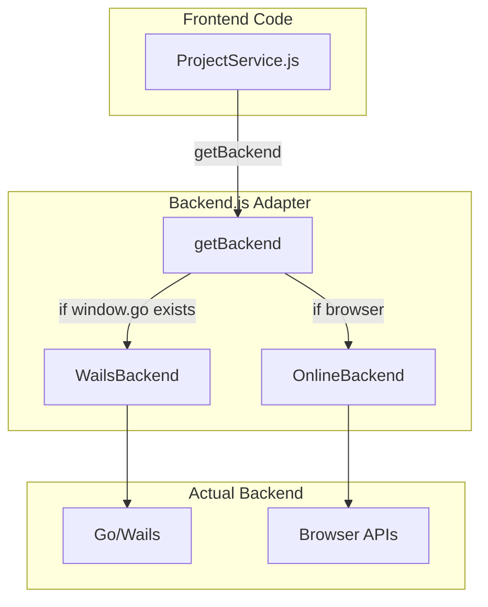
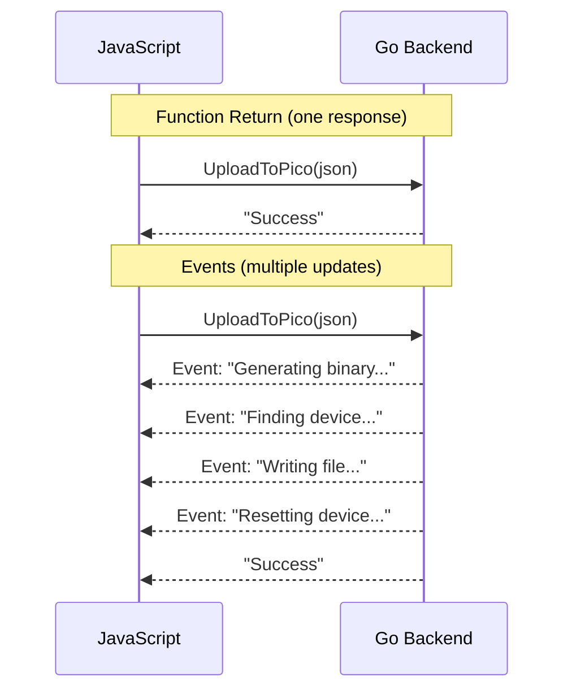
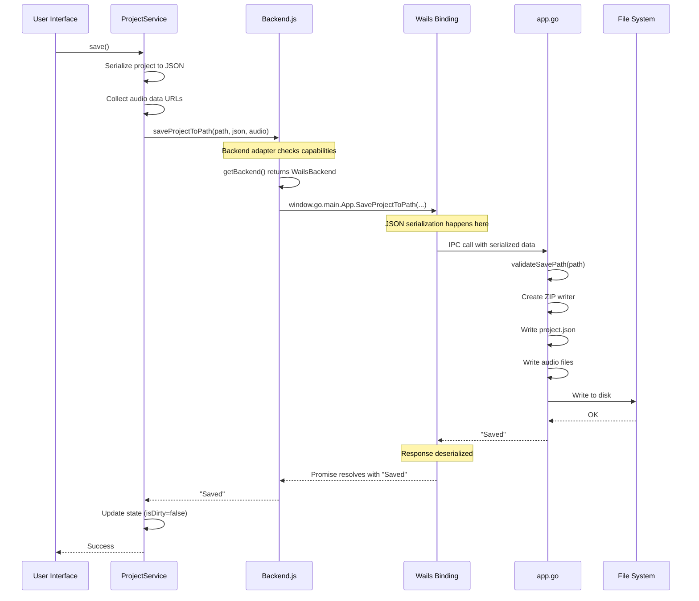

# Wails Framework

This document explains how Wails bridges JavaScript and Go, enabling the frontend to call backend functions.

---

## How Wails Works

Wails creates a bridge between two different languages/runtimes:

| Country | Language | Our App |
|---------|----------|---------|
| **JavaScriptland** | JavaScript objects, Promises | Frontend |
| **GoLand** | Structs, error tuples | Backend |
| **The Embassy** | Translators, protocols | Wails Bridge |

When JavaScript wants something from Go, it goes through the bridge which:
1. Takes the JavaScript message
2. Translates it to Go
3. Sends it to Go
4. Gets the response
5. Translates back to JavaScript
6. Returns to the caller

---

## The Setup (main.go)

```go
// main.go - This is where it all starts
func main() {
    app := NewApp()  // Create our App instance

    err := wails.Run(&options.App{
        Title:  "PicoLume Studio",
        Width:  1280,
        Height: 800,

        // This is the magic line:
        Bind: []interface{}{
            app,  // All methods on 'app' become callable from JS
        },

        // Frontend assets are embedded in the binary
        Assets: assets,

        OnStartup: app.startup,  // Called when app launches
    })
}
```

## The Binding Magic

When you write a Go function:
```go
func (a *App) SaveProjectToPath(path string, projectJson string, audioFiles map[string]string) string {
    // ...
}
```

Wails automatically generates:
```javascript
// In frontend/src/wailsjs/go/main/App.js (auto-generated)
export function SaveProjectToPath(path, projectJson, audioFiles) {
    return window['go']['main']['App']['SaveProjectToPath'](path, projectJson, audioFiles);
}
```

```mermaid
flowchart LR
    subgraph "Your Code"
        GO[app.go<br/>SaveProjectToPath]
        JS[Your JS<br/>import { SaveProjectToPath }]
    end

    subgraph "Wails Generated"
        BIND[App.js binding]
        WINDOW[window.go.main.App]
    end

    GO -->|Wails compile| BIND
    JS -->|imports| BIND
    BIND -->|calls| WINDOW
    WINDOW -.->|IPC| GO
```

---

## Translation Rules

### Rule 1: Everything is JSON

When you call a Go function from JS, all parameters are **JSON serialized**.

```javascript
// JavaScript sends:
SaveProjectToPath("/path/to/file.lum", '{"name":"My Show"}', {"audio_1": "data:..."})

// Go receives:
// path = "/path/to/file.lum"
// projectJson = "{\"name\":\"My Show\"}"
// audioFiles = map[string]string{"audio_1": "data:..."}
```

**What This Means:**
- No functions can cross the boundary
- No circular references
- No DOM elements
- No class instances (they become plain objects)

### Rule 2: Return Values are Promises

Every Go function returns a Promise in JavaScript:

```javascript
// Go returns string:
func (a *App) SaveProjectToPath(...) string { return "Saved" }

// JavaScript receives Promise<string>:
const result = await SaveProjectToPath(...);  // result = "Saved"
```

### Rule 3: Errors Become Rejected Promises

```go
// Go can return error as second value:
func (a *App) SomeMethod() (string, error) {
    return "", errors.New("something went wrong")
}
```

```javascript
// JavaScript sees rejected promise:
try {
    await SomeMethod();
} catch (err) {
    console.error(err);  // "something went wrong"
}
```

**Note:** In PicoLume, we often return error messages as strings instead of Go errors. This gives us more control over the message format:

```go
func (a *App) SaveProjectToPath(...) string {
    if err != nil {
        return "Error: " + err.Error()  // Controlled error message
    }
    return "Saved"
}
```

---

## Type Mappings

Here's how types translate between languages:

| Go Type | JavaScript Type | Notes |
|---------|-----------------|-------|
| `string` | `string` | Direct mapping |
| `int`, `int64`, `float64` | `number` | All become JS number |
| `bool` | `boolean` | Direct mapping |
| `[]T` | `Array<T>` | Slices become arrays |
| `map[string]T` | `Object` | Maps become objects |
| `struct` | `Object` | Fields become properties |
| `*T` (pointer) | `T` or `null` | Nil becomes null |
| `error` | `Error` (rejected) | When returned as second value |

### Struct Example

```go
// Go struct
type PicoConnectionStatus struct {
    Connected        bool   `json:"connected"`
    Mode             string `json:"mode"`
    USBDrive         string `json:"usbDrive"`
    SerialPort       string `json:"serialPort"`
    SerialPortLocked bool   `json:"serialPortLocked"`
}

func (a *App) GetPicoConnectionStatus() PicoConnectionStatus {
    return PicoConnectionStatus{
        Connected: true,
        Mode:      "USB+SERIAL",
        USBDrive:  "E:/",
        SerialPort: "COM5",
    }
}
```

```javascript
// JavaScript receives:
const status = await GetPicoConnectionStatus();
// status = {
//     connected: true,
//     mode: "USB+SERIAL",
//     usbDrive: "E:/",
//     serialPort: "COM5",
//     serialPortLocked: false
// }
```

**Note the `json` tags!** They control the JavaScript property names. Without them, Go uses the field name directly (which would be `Connected` not `connected`).

---

## The Backend Adapter Pattern

PicoLume has two modes:
1. **Desktop App** - Full Wails backend available
2. **Online Version** - Running in a browser, no Go backend

The adapter lets the same frontend code work in both:



### How It Works

```javascript
// core/Backend.js

// Capability flags tell you what's available
class WailsBackend {
    capabilities = {
        canSave: true,
        canLoad: true,
        canExport: true,
        canUpload: true,        // Only desktop can upload to hardware
        canCheckConnection: true // Only desktop can check Pico status
    };

    async saveProjectToPath(path, projectJson, audioFiles) {
        // Call real Go function
        return window.go.main.App.SaveProjectToPath(path, projectJson, audioFiles);
    }
}

class OnlineBackend {
    capabilities = {
        canSave: true,          // Uses File System Access API
        canLoad: true,          // Uses file picker
        canExport: false,       // No binary generation in browser
        canUpload: false,       // No hardware access
        canCheckConnection: false
    };

    async saveProjectToPath(path, projectJson, audioFiles) {
        // Use browser File System Access API
        const handle = await window.showSaveFilePicker({...});
        // ... write file using browser APIs
    }
}

// Factory function picks the right one
export function getBackend() {
    if (window.go?.main?.App) {
        return new WailsBackend();
    }
    return new OnlineBackend();
}
```

### Using the Adapter

```javascript
// In ProjectService.js
import { getBackend } from '../core/Backend.js';

class ProjectService {
    async save(path, forceSaveAs, silent) {
        const backend = getBackend();

        // Check capability before calling
        if (!backend.capabilities.canSave) {
            throw new Error('Save not available in this environment');
        }

        // Use the adapter - works in both environments
        const result = await backend.saveProjectToPath(path, json, audioFiles);
        return result;
    }
}
```

This **Adapter Pattern** appears everywhere in software:
- Database drivers (same interface, different databases)
- Payment processors (same interface, different providers)
- Storage backends (same interface, S3/GCS/local)

---

## Wails Events

Beyond function calls, Wails supports **events** for backend → frontend communication:

```go
// Go backend emits an event
runtime.EventsEmit(a.ctx, "upload:status", "Writing file...")
runtime.EventsEmit(a.ctx, "upload:manual-eject", true)
```

```javascript
// JavaScript listens
import { EventsOn } from '../wailsjs/runtime/runtime.js';

EventsOn("upload:status", (message) => {
    showStatus(message);  // "Writing file..."
});

EventsOn("upload:manual-eject", (required) => {
    if (required) showEjectDialog();
});
```

### When to Use Events vs Returns

| Use Case | Mechanism |
|----------|-----------|
| Single response | Return value |
| Progress updates | Events |
| Async notifications | Events |
| Streaming data | Events |



---

## Reading Go Code: A Primer

You don't need to become a Go expert, but here's enough to read `app.go`:

### Function Syntax

```go
// Method on App struct
func (a *App) MethodName(param1 string, param2 int) string {
    return "result"
}

// (a *App)    = This method belongs to App
// MethodName  = Exported (capital letter) = callable from JS
// param1, param2 = Parameters with types after names
// string      = Return type (after parameters)
```

### Error Handling

```go
// Go doesn't have exceptions, uses error returns
file, err := os.Open(path)
if err != nil {
    return "Error: " + err.Error()
}
// Use file...
```

### Defer for Cleanup

```go
func (a *App) SaveProjectToPath(...) string {
    file, err := os.Create(path)
    if err != nil {
        return "Error: " + err.Error()
    }
    defer file.Close()  // This runs when function exits, no matter what

    // ... use file ...
    return "Saved"
}
```

### Maps and Slices

```go
// Map (like JavaScript object)
audioFiles map[string]string  // map[keyType]valueType

// Slice (like JavaScript array)
tracks []Track  // []elementType
```

---

## Complete Round-Trip Example

Here's how a complete round-trip works:



---

## Common Gotchas

### 1. Forgetting Async/Await

```javascript
// Wrong - result is a Promise, not the value
const result = SaveProjectToPath(path, json, audio);
if (result === "Saved") { ... }  // Always false!

// Right - await the Promise
const result = await SaveProjectToPath(path, json, audio);
if (result === "Saved") { ... }  // Works
```

### 2. Passing Non-Serializable Data

```javascript
// Wrong - functions can't cross the bridge
const callback = () => console.log('done');
SomeGoFunction(callback);  // Error!

// Wrong - DOM elements can't cross
const element = document.getElementById('foo');
SomeGoFunction(element);  // Error!

// Right - only JSON-serializable data
SomeGoFunction({ name: "test", count: 5 });
```

### 3. Expecting Go Conventions in JS

```go
// Go returns (value, error) tuple
func Something() (string, error)
```

```javascript
// JS gets Promise that rejects on error
try {
    const value = await Something();
} catch (error) {
    // Handle error
}
```

---

## Summary

### Key Takeaways

1. **Wails bridges JS and Go** via auto-generated bindings
2. **Everything is JSON** - only serializable data crosses the boundary
3. **Go functions become Promises** in JavaScript
4. **Backend adapter pattern** lets us support multiple environments
5. **Events** handle progress and async notifications

### Mental Model

Think of the Wails bridge as a **translator at the border**:
- Takes your JavaScript request
- Translates to Go
- Waits for Go to process
- Translates the response back
- Returns to JavaScript

The translator only knows JSON, so anything that can't be JSON-ified can't cross.

---

[← Architecture Overview](01-architecture-overview.md) | [Index](README.md) | [State Management →](03-state-management.md)
