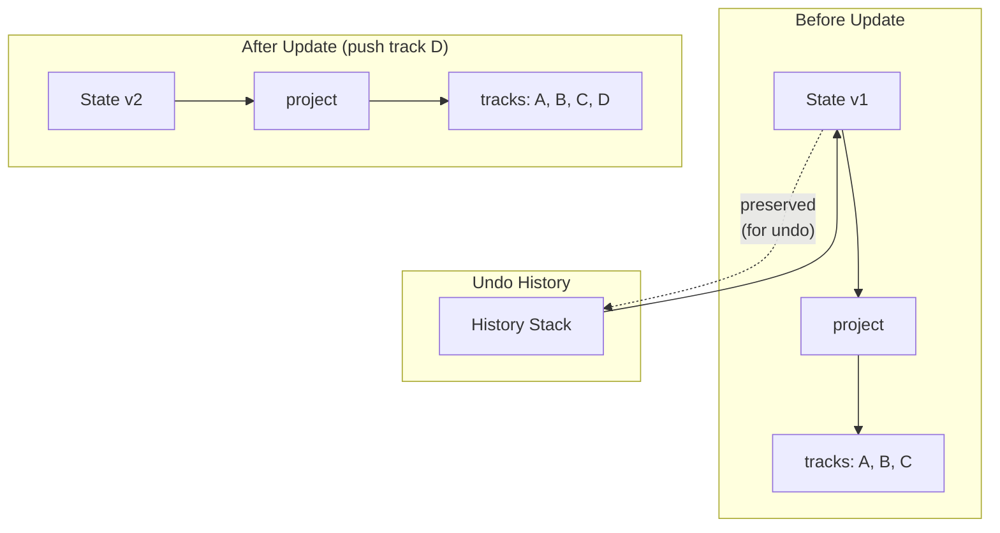
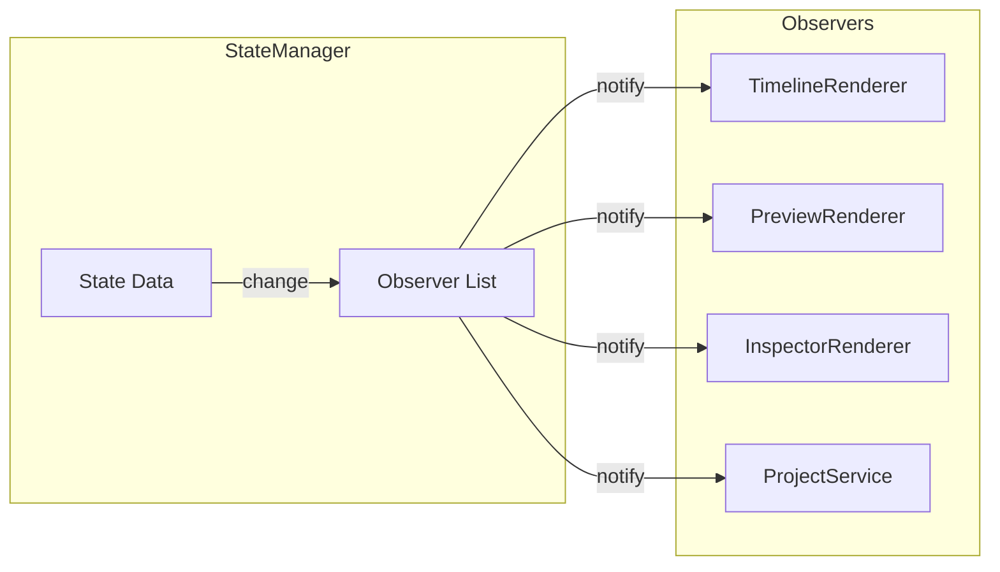
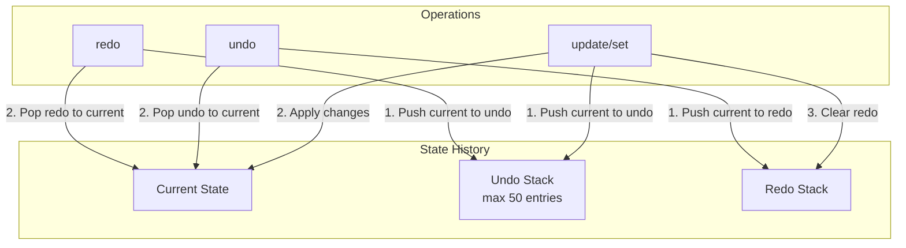

# Lesson 3: State Management

## Learning Objectives

By the end of this lesson, you will be able to:
- Explain why centralized state matters
- Use StateManager to read and write data
- Understand immutable updates and why they're important
- Implement and understand the observer pattern
- Work with the undo/redo system

---

## The Library Analogy

Imagine a library (the old-fashioned kind with books):

**Without Centralized State (Bad):**
- Every department has their own copy of the catalog
- When a book is checked out, you update YOUR copy
- Other departments don't know
- Chaos ensues

**With Centralized State (Good):**
- ONE master catalog
- All departments check/update the SAME catalog
- Everyone sees the same truth
- When something changes, announcements are made

StateManager is our master catalog.

---

## The State Shape

Here's everything StateManager tracks:

```javascript
{
    // === THE PROJECT (saved to .lum file) ===
    project: {
        version: '0.2.2',
        name: "My Show",
        duration: 60000,           // Total show length in ms
        settings: {
            profiles: [...],       // Hardware configurations
            patch: {},             // Prop ID → Profile ID mapping
            fieldLayout: {},       // Prop positions for field preview
            palettes: [...]        // Color palettes
        },
        propGroups: [...],         // Logical groupings (e.g., "Snares")
        tracks: [...]              // Timeline data
    },

    // === AUDIO DATA (saved to .lum file) ===
    assets: {},                    // bufferId → AudioBuffer (decoded)
    audioLibrary: {},              // bufferId → data URL (raw)

    // === RUNTIME STATE (not saved) ===
    activeAudioSources: [],        // Currently playing audio nodes
    selection: [],                 // Selected clip IDs
    filePath: null,                // Current project file path
    isDirty: false,                // Has unsaved changes?
    autoSaveEnabled: true,

    playback: {
        isPlaying: false,
        currentTime: 0,            // Current playhead position (ms)
        startTime: 0               // When playback started (context time)
    },

    ui: {
        zoom: 50,                  // Pixels per second
        snapEnabled: true,
        gridSize: 1000,            // Snap grid in ms
        previewMode: 'track'       // 'track' | 'field' | 'off'
    },

    audio: {
        ctx: null,                 // AudioContext
        masterGain: null,          // GainNode for volume
        masterVolume: 1.0
    },

    clipboard: null,               // Copied clips
    lastPreviewRender: 0           // Timestamp for throttling
}
```

### What Gets Saved vs. What Doesn't

| Saved to .lum | NOT Saved |
|---------------|-----------|
| `project.*` | `selection` |
| `audioLibrary` | `playback` |
| | `ui` (zoom, snap settings) |
| | `isDirty`, `filePath` |
| | `audio` (Web Audio objects) |

**Why?** Things like "which clip is selected" or "current playhead position" are ephemeral - they don't make sense to restore when you reopen a project.

---

## Reading State

### The `get()` Method

```javascript
// Get a value by path
const name = stateManager.get('project.name');           // "My Show"
const zoom = stateManager.get('ui.zoom');                 // 50
const tracks = stateManager.get('project.tracks');        // [...]
const firstTrack = stateManager.get('project.tracks.0');  // {...}
```

**Path Syntax:**
- Dot-separated: `'project.settings.profiles'`
- Array indices: `'project.tracks.0.clips'`
- Returns `undefined` for missing paths

### The `getState()` Method

```javascript
// Get the entire state object
const state = stateManager.getState();

// Now you can access anything
console.log(state.project.name);
console.log(state.selection);
```

**Warning:** The returned object is frozen (immutable). You cannot modify it directly.

---

## Writing State

### The `set()` Method (Simple)

```javascript
// Set a single value
stateManager.set('project.name', 'New Show Name');
stateManager.set('ui.zoom', 75);
stateManager.set('isDirty', true);
```

### The `update()` Method (Complex)

For complex updates, use `update()` with a draft:

```javascript
// Add a new track
stateManager.update(draft => {
    draft.project.tracks.push({
        id: 't_' + Date.now(),
        type: 'led',
        label: 'New Track',
        groupId: null,
        clips: []
    });
    draft.isDirty = true;
});

// Modify multiple things at once
stateManager.update(draft => {
    draft.project.name = 'Updated Show';
    draft.project.duration = 90000;
    draft.isDirty = true;
});
```

**Why `update()` instead of `set()` for complex changes?**
- Atomic: All changes happen together
- Efficient: Only one notification to observers
- Safe: The draft prevents accidental mutations

---

## Immutability: Why It Matters

### The Problem with Mutability

```javascript
// BAD: Direct mutation
const tracks = stateManager.get('project.tracks');
tracks.push(newTrack);  // Mutating the actual state!

// Now state is changed but nobody knows
// No observers notified
// Undo won't work
// UI won't update
```

### The Immutable Solution

```javascript
// GOOD: Use update()
stateManager.update(draft => {
    draft.project.tracks.push(newTrack);
});

// Now:
// 1. A NEW state object is created
// 2. Old state goes to undo history
// 3. Observers are notified
// 4. UI updates
```

### How Immutability Works



The old state is preserved - we don't modify it, we create a new one with changes. This makes undo trivial: just restore the old state.

---

## The Observer Pattern

### How It Works



### Subscribing to All Changes

```javascript
// Subscribe to ANY state change
const unsubscribe = stateManager.subscribe((newState, oldState) => {
    console.log('State changed!');
    console.log('Old:', oldState.project.name);
    console.log('New:', newState.project.name);
});

// Later, to stop listening:
unsubscribe();
```

### Subscribing to Specific Paths

```javascript
// Only care about zoom changes
stateManager.subscribeTo('ui.zoom', (newZoom, oldZoom) => {
    console.log(`Zoom changed from ${oldZoom} to ${newZoom}`);
    redrawTimeline();
});

// Only care about selection changes
stateManager.subscribeTo('selection', (newSelection) => {
    updateInspector(newSelection);
});
```

### Real Example: Auto-Save

```javascript
// In Application.js
stateManager.subscribeTo('isDirty', (isDirty) => {
    if (isDirty && state.filePath && state.autoSaveEnabled) {
        // Debounced auto-save
        scheduleAutoSave();
    }
});
```

**Pattern Alert!** The Observer Pattern appears everywhere:
- DOM events (`element.addEventListener`)
- React's state (`useState` triggers re-render)
- Vue's reactivity system
- Redux's `subscribe()`

---

## The Undo/Redo System

### How It Works



### Using Undo/Redo

```javascript
// Undo the last action
stateManager.undo();

// Redo the last undone action
stateManager.redo();

// Check if undo/redo is available
const canUndo = stateManager.canUndo();  // true/false
const canRedo = stateManager.canRedo();  // true/false
```

### Skipping History

Sometimes you don't want an action recorded:

```javascript
// This WON'T be added to undo history
stateManager.update(draft => {
    draft.playback.currentTime = 5000;
}, { skipHistory: true });

// Good for:
// - Playhead position updates (hundreds per second during playback)
// - Preview render timestamps
// - Temporary UI states
```

### History Limit

We cap undo history at 50 entries to prevent memory issues:

```javascript
// If undo stack has 50 entries and you make a change:
// - Oldest entry is dropped
// - New state is pushed
// Result: Still 50 entries
```

---

## Special Handling: Audio Objects

Web Audio API objects (`AudioContext`, `AudioBuffer`, `GainNode`) are NOT cloneable. StateManager has special handling:

```javascript
// These paths are NOT cloned/frozen:
const SHALLOW_COPY_PATHS = [
    'audio',       // AudioContext, GainNode
    'assets',      // AudioBuffer objects
    'activeAudioSources'  // Playing audio nodes
];
```

This means:
- Audio objects are passed by reference
- They're not included in undo history
- You can mutate them directly (carefully!)

---

## Putting It Together: A Complete Example

Let's trace adding a clip:

```javascript
// 1. User drags effect to timeline
// TimelineController handles this:

addClip(trackId, clipData) {
    // 2. Validate the clip
    if (!validateClip(clipData)) {
        ErrorHandler.show('Invalid clip data');
        return null;
    }

    // 3. Generate unique ID
    const clipId = 'c_' + Date.now();
    const clip = { id: clipId, ...clipData };

    // 4. Update state
    stateManager.update(draft => {
        // Find the track
        const track = draft.project.tracks.find(t => t.id === trackId);
        if (track) {
            // Add the clip
            track.clips.push(clip);
            // Mark as dirty
            draft.isDirty = true;
        }
    });

    // 5. Notify the world
    window.dispatchEvent(new CustomEvent('app:timeline-changed'));

    // 6. Return the ID for selection
    return clipId;
}
```

What happens automatically:
- Old state pushed to undo stack
- All observers notified
- TimelineRenderer re-draws
- InspectorRenderer shows clip properties
- Title bar shows "*" (dirty indicator)

---

## Common Patterns

### Pattern 1: Read-Modify-Write

```javascript
// Get current value
const tracks = stateManager.get('project.tracks');
const trackIndex = tracks.findIndex(t => t.id === trackId);

// Update with full knowledge
stateManager.update(draft => {
    draft.project.tracks[trackIndex].label = newLabel;
    draft.isDirty = true;
});
```

### Pattern 2: Conditional Update

```javascript
stateManager.update(draft => {
    const clip = findClipById(draft.project.tracks, clipId);
    if (clip) {
        clip.props.color = newColor;
        draft.isDirty = true;
    }
    // If clip not found, no changes made
});
```

### Pattern 3: Batch Updates

```javascript
// Multiple changes, single history entry
stateManager.update(draft => {
    draft.project.name = 'New Name';
    draft.project.duration = 120000;
    draft.project.settings.brightness = 200;
    draft.isDirty = true;
});
```

### Pattern 4: Replace Everything

```javascript
// When loading a project
stateManager.replaceState(newState, { clearHistory: true });

// This:
// - Replaces the entire state
// - Optionally clears undo history
// - Notifies all observers
```

---

## Debugging State

### Log State Changes

```javascript
// Add this to see every change
stateManager.subscribe((newState, oldState) => {
    console.log('State changed:', {
        old: oldState,
        new: newState
    });
});
```

### Inspect Current State

```javascript
// In browser console
console.log(window.stateManager?.getState());
```

### Check History

```javascript
console.log('Undo depth:', stateManager.undoStack.length);
console.log('Redo depth:', stateManager.redoStack.length);
```

---

## Exercise: Implement a Feature

Try implementing "Clear All Clips" functionality:

1. Add a method to TimelineController
2. It should:
   - Remove all clips from all LED tracks
   - Not affect audio tracks
   - Be undoable
   - Mark project as dirty
   - Dispatch `app:timeline-changed`

<details>
<summary>Solution</summary>

```javascript
clearAllLedClips() {
    stateManager.update(draft => {
        draft.project.tracks.forEach(track => {
            if (track.type === 'led') {
                track.clips = [];
            }
        });
        draft.isDirty = true;
    });

    window.dispatchEvent(new CustomEvent('app:timeline-changed'));
}
```
</details>

---

## Summary

### Key Takeaways

1. **Single Source of Truth** - All data in one place
2. **Immutable Updates** - Never mutate, always create new state
3. **Observer Pattern** - Components react to changes automatically
4. **Undo/Redo for Free** - Immutability makes history trivial
5. **Path-Based Access** - `get('a.b.c')` and `subscribeTo('a.b.c')`

### The Mental Model

Think of StateManager as a **newspaper with subscriptions**:
- The newspaper (state) is published
- Subscribers get notified of new editions
- Each edition is a complete snapshot (immutable)
- Old editions are archived (undo history)
- Nobody can edit a published edition (frozen state)

---

## Next Lesson

In [Lesson 4: The Service Layer](04-service-layer.md), we'll explore:
- What services do vs. controllers
- AudioService: Web Audio API management
- ProjectService: Save/Load/Export operations
- How services interact with StateManager and Backend

---

[← The Wails Framework](02-wails-framework.md) | [Course Index](README.md) | [The Service Layer →](04-service-layer.md)
