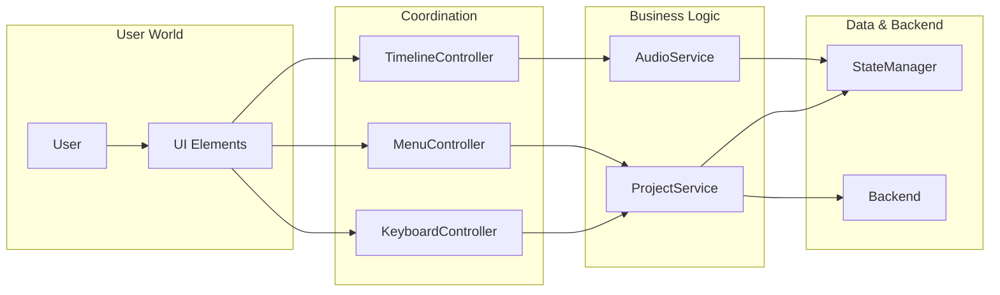
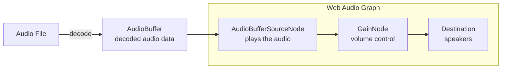
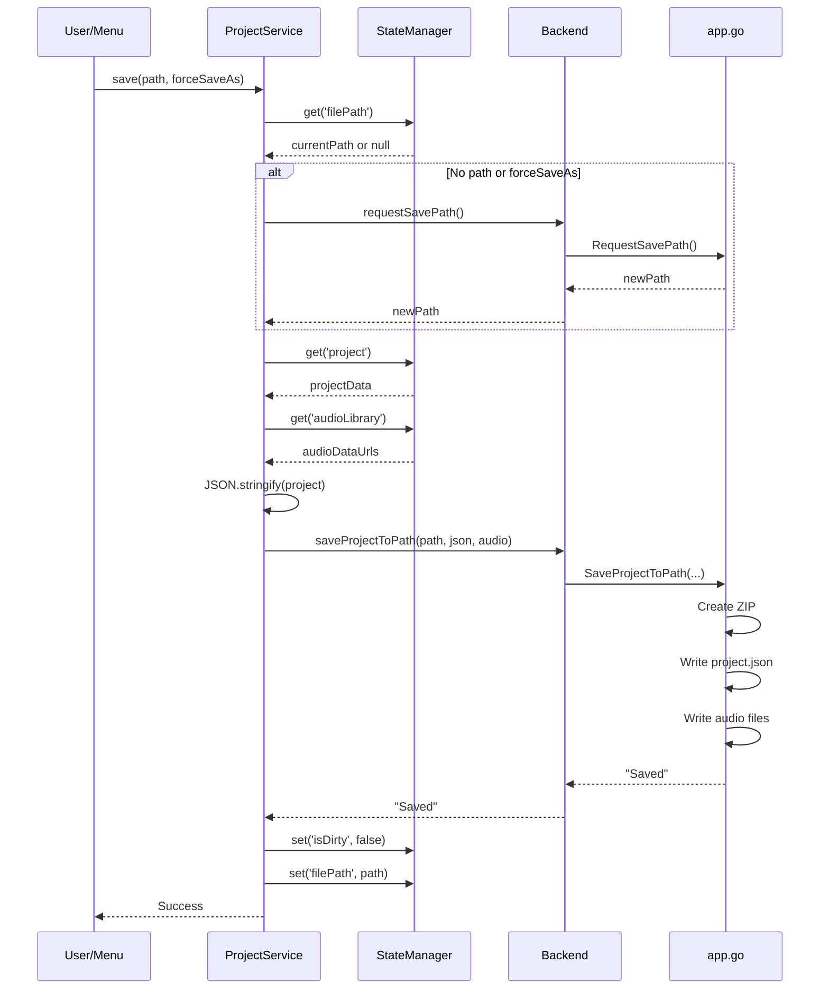
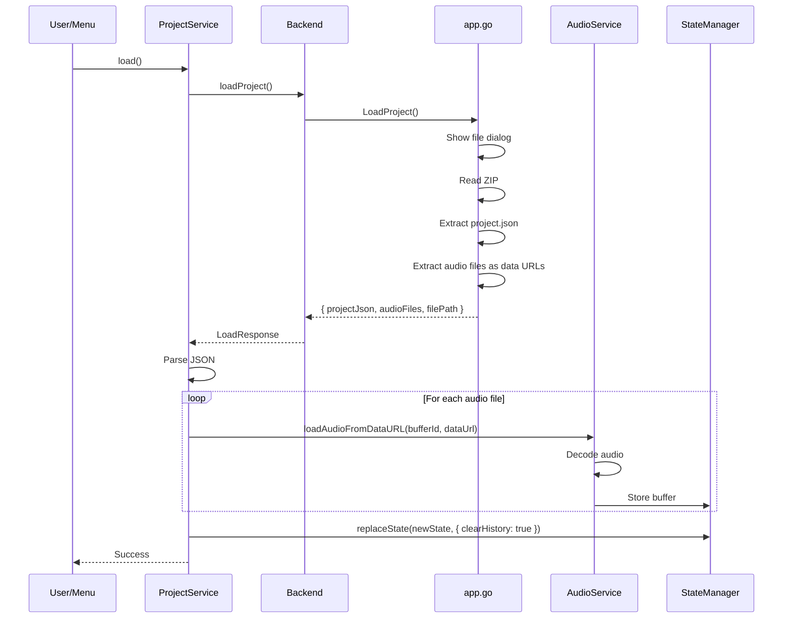

# Service Layer

This document explains the service layer pattern in PicoLume Studio, focusing on AudioService and ProjectService.

---

## Services vs Controllers

Services and controllers have distinct responsibilities:

| Aspect | Service | Controller |
|--------|---------|------------|
| **Purpose** | Business logic | User interaction handling |
| **Knows About** | How to do things | What the user wants |
| **Calls** | Backend, StateManager | Services, StateManager |
| **Called By** | Controllers, other Services | Event handlers, UI |
| **Example** | "Save project to ZIP format" | "User clicked Save button" |

### The Relationship



---

## AudioService

AudioService manages everything related to sound:
- Loading audio files
- Decoding audio data
- Playing/stopping audio
- Managing the Web Audio API context

### Web Audio API Overview



**Key Concepts:**
- `AudioContext` - The audio processing graph
- `AudioBuffer` - Decoded audio data (like a loaded image)
- `AudioBufferSourceNode` - Plays a buffer (one-shot, can't restart)
- `GainNode` - Controls volume

### Loading Audio

```javascript
// AudioService.js - Simplified

async loadAudioFile(file, bufferId) {
    // 1. Read file to ArrayBuffer
    const arrayBuffer = await withTimeout(
        readFileAsArrayBuffer(file),
        TIMEOUT.FILE_READ,
        'File read timed out'
    );

    // 2. Create data URL for storage
    const blob = new Blob([arrayBuffer], { type: file.type });
    const dataUrl = await blobToDataURL(blob);

    // 3. Decode audio data
    const audioBuffer = await withRetry(
        () => decodeAudioWithTimeout(arrayBuffer),
        { maxRetries: 2, shouldRetry: isTransientError }
    );

    // 4. Store in state
    stateManager.update(draft => {
        draft.assets[bufferId] = audioBuffer;
        draft.audioLibrary[bufferId] = dataUrl;
    }, { skipHistory: true });

    return { bufferId, duration: audioBuffer.duration * 1000 };
}
```

### The Retry Pattern

Audio decoding can fail for transient reasons (browser hiccup, resource contention). We use retry logic:

```javascript
// Retry with exponential backoff
async function withRetry(fn, options) {
    const { maxRetries = 2, baseDelayMs = 500 } = options;

    for (let attempt = 0; attempt <= maxRetries; attempt++) {
        try {
            return await fn();
        } catch (error) {
            if (attempt === maxRetries || !shouldRetry(error)) {
                throw error;
            }
            // Wait with exponential backoff + jitter
            const delay = baseDelayMs * Math.pow(2, attempt) + Math.random() * 100;
            await sleep(delay);
        }
    }
}
```

Retry with exponential backoff is used everywhere:
- Network requests
- Database connections
- API rate limits
- Audio decoding

### Playing Audio

```javascript
// AudioService.js - Simplified

startPlayback(startTime = 0) {
    const ctx = stateManager.get('audio.ctx');
    const assets = stateManager.get('assets');

    // Find audio clips in timeline
    const audioClips = getAllAudioClips();

    audioClips.forEach(clip => {
        const buffer = assets[clip.bufferId];
        if (!buffer) return;

        // Create source node (one-shot)
        const source = ctx.createBufferSource();
        source.buffer = buffer;
        source.connect(stateManager.get('audio.masterGain'));

        // Calculate when to start
        const clipStartTime = clip.startTime / 1000;  // ms to seconds
        const offset = Math.max(0, startTime / 1000 - clipStartTime);
        const when = Math.max(0, clipStartTime - startTime / 1000);

        source.start(ctx.currentTime + when, offset);

        // Track active sources for stopping
        stateManager.update(draft => {
            draft.activeAudioSources.push(source);
        }, { skipHistory: true });
    });
}

stopPlayback() {
    const sources = stateManager.get('activeAudioSources');
    sources.forEach(source => {
        try { source.stop(); } catch (e) { /* already stopped */ }
    });

    stateManager.update(draft => {
        draft.activeAudioSources = [];
    }, { skipHistory: true });
}
```

### Why `skipHistory: true`?

Audio state changes shouldn't be undoable:
- Playing/stopping is ephemeral
- `activeAudioSources` changes rapidly
- You can't "undo" a sound that already played

---

## ProjectService

ProjectService handles project lifecycle:
- Creating new projects
- Saving projects
- Loading projects
- Exporting binaries
- Uploading to hardware

### Save Flow



### The Save Method

```javascript
// ProjectService.js - Simplified

async save(path = null, forceSaveAs = false, silent = false) {
    const backend = getBackend();

    // Capability check
    if (!backend.capabilities.canSave) {
        throw new Error('Save not available');
    }

    // Get or request path
    let savePath = path || stateManager.get('filePath');
    if (!savePath || forceSaveAs) {
        savePath = await backend.requestSavePath();
        if (!savePath) return null;  // User cancelled
    }

    // Gather data
    const project = stateManager.get('project');
    const audioLibrary = stateManager.get('audioLibrary');
    const projectJson = JSON.stringify(project, null, 2);

    // Call backend
    const result = await backend.saveProjectToPath(savePath, projectJson, audioLibrary);

    if (result.startsWith('Error')) {
        if (!silent) ErrorHandler.show(result);
        return null;
    }

    // Update state
    stateManager.update(draft => {
        draft.filePath = savePath;
        draft.isDirty = false;
    });

    if (!silent) {
        ErrorHandler.show('Project saved', 'success');
    }

    return savePath;
}
```

### Load Flow



### Creating a New Project

```javascript
// ProjectService.js

async createNew(skipConfirm = false) {
    // Check for unsaved changes
    if (!skipConfirm && stateManager.get('isDirty')) {
        const confirmed = await confirm('You have unsaved changes. Continue?');
        if (!confirmed) return false;
    }

    // Clear audio buffers (memory cleanup)
    const assets = stateManager.get('assets');
    Object.keys(assets).forEach(key => {
        delete assets[key];  // AudioBuffers can't be frozen
    });

    // Reset to initial state
    stateManager.replaceState({
        project: createDefaultProject(),
        assets: {},
        audioLibrary: {},
        selection: [],
        filePath: null,
        isDirty: false,
        // ... rest of initial state
    }, { clearHistory: true });

    return true;
}

function createDefaultProject() {
    return {
        version: '0.2.2',
        name: 'My Show',
        duration: 60000,
        settings: {
            profiles: [createDefaultProfile()],
            patch: {},
            fieldLayout: {},
            palettes: []
        },
        propGroups: [],
        tracks: [
            { id: 't_audio', type: 'audio', label: 'Audio', clips: [] },
            { id: 't_led', type: 'led', label: 'All Props', groupId: null, clips: [] }
        ]
    };
}
```

---

## The Timeout Pattern

Network and file operations can hang. We wrap them with timeouts:

```javascript
// Utility function
function withTimeout(promise, timeoutMs, errorMessage) {
    return new Promise((resolve, reject) => {
        const timer = setTimeout(() => {
            reject(new Error(errorMessage));
        }, timeoutMs);

        promise
            .then(result => {
                clearTimeout(timer);
                resolve(result);
            })
            .catch(error => {
                clearTimeout(timer);
                reject(error);
            });
    });
}

// Usage
const result = await withTimeout(
    someAsyncOperation(),
    30000,  // 30 second timeout
    'Operation timed out'
);
```

### Timeout Values

| Operation | Timeout | Why |
|-----------|---------|-----|
| Audio context resume | 5s | Should be instant |
| File read | 30s | Large files need time |
| Audio decode | 60s | Complex audio takes longer |
| Network fetch | 30s | Standard web timeout |
| Blob conversion | 30s | Memory operations |

---

## Error Handling in Services

### The ErrorHandler Integration

```javascript
// Services use ErrorHandler for user-facing errors
import { ErrorHandler } from '../core/ErrorHandler.js';

async save(path, forceSaveAs, silent = false) {
    try {
        // ... save logic ...
    } catch (error) {
        if (!silent) {
            ErrorHandler.show(`Failed to save: ${error.message}`, 'error');
        }
        console.error('Save error:', error);
        return null;
    }
}
```

### Error Categories

| Category | Example | User Action |
|----------|---------|-------------|
| **User Error** | Invalid file selected | Show message, let user retry |
| **Transient** | Decode timeout | Retry automatically |
| **Fatal** | Disk full | Show error, can't recover |

---

## Auto-Save Implementation

Auto-save is coordinated between Application.js and ProjectService:

```javascript
// Application.js

let autoSaveTimer = null;

// Subscribe to dirty state
stateManager.subscribeTo('isDirty', (isDirty) => {
    if (isDirty && shouldAutoSave()) {
        scheduleAutoSave();
    }
});

function shouldAutoSave() {
    return stateManager.get('autoSaveEnabled')
        && stateManager.get('filePath');  // Must have a save path
}

function scheduleAutoSave() {
    // Debounce: wait 2 seconds after last change
    clearTimeout(autoSaveTimer);
    autoSaveTimer = setTimeout(() => {
        projectService.save(null, false, true);  // silent = true
    }, 2000);
}
```

Debouncing prevents rapid-fire saves when user is actively editing. The 2-second delay means we save 2 seconds after the user stops making changes.

---

## Service Initialization

Services are created during Application bootstrap:

```javascript
// Application.js

class Application {
    async init() {
        // 1. Create state manager
        this.stateManager = new StateManager(initialState);

        // 2. Create error handler
        this.errorHandler = new ErrorHandler();

        // 3. Create services (they receive dependencies)
        this.audioService = new AudioService(this.stateManager);
        this.projectService = new ProjectService(
            this.stateManager,
            this.audioService,
            this.errorHandler
        );

        // 4. Create controllers (they receive services)
        this.timelineController = new TimelineController(
            this.stateManager,
            this.audioService
        );

        // 5. Wire up event listeners
        this.setupEventListeners();
    }
}
```

This is **Dependency Injection**: components receive their dependencies rather than creating them. Benefits:
- Easier testing (inject mock dependencies)
- Clear dependency graph
- Single source of truth for instances

---

## Summary

### Key Takeaways

1. **Services = Business Logic** - They know HOW to do things
2. **Controllers = Coordination** - They know WHAT the user wants
3. **Dependency Injection** - Services receive their dependencies
4. **Resilience Patterns** - Timeouts, retries, error handling
5. **Audio is Special** - Web Audio API objects aren't clonable

### Mental Model

Services are **specialists**:
- AudioService is your audio engineer
- ProjectService is your file manager

They don't care about UI, buttons, or keyboard shortcuts. They just do their specialized job when asked.

---

[← State Management](03-state-management.md) | [Index](README.md) | [Controllers →](05-controllers.md)
