# Lesson 5: Controllers

## Learning Objectives

By the end of this lesson, you will be able to:
- Understand the role of controllers in the architecture
- Work with TimelineController for clip/track operations
- Implement keyboard shortcuts with KeyboardController
- Use custom events for component coordination
- Understand the undo/redo integration in UndoController

---

## The Air Traffic Controller Analogy

Controllers are like air traffic controllers at an airport:

| Airport | Our App |
|---------|---------|
| Planes requesting landing | User actions (clicks, keys) |
| Air traffic controller | Controller classes |
| Runways, gates, fuel trucks | Services, StateManager |
| Control tower displays | UI/Renderers |

The controller doesn't fly the planes or fuel them. It **coordinates** - routing requests to the right place and ensuring nothing collides.

---

## The Controller Family

```mermaid
flowchart TB
    subgraph "User Actions"
        KEY[Keyboard]
        MOUSE[Mouse/Touch]
        MENU[Menu Clicks]
    end

    subgraph "Controllers"
        KC[KeyboardController<br/>🎹 Shortcuts]
        TC[TimelineController<br/>⏱️ Clips/Tracks]
        MC[MenuController<br/>📋 Menu Actions]
        UC[UndoController<br/>↩️ History]
        TM[ThemeManager<br/>🎨 Themes]
    end

    subgraph "Services & State"
        PS[ProjectService]
        AS[AudioService]
        SM[StateManager]
    end

    KEY --> KC
    MOUSE --> TC
    MENU --> MC

    KC --> TC & PS & UC
    TC --> SM & AS
    MC --> PS & TM
    UC --> SM
    TM --> SM
```



---

## TimelineController: The Heart of Editing

TimelineController handles all timeline operations. It's the biggest controller because the timeline IS the app.

### Track Operations

```javascript
// TimelineController.js - Simplified

class TimelineController {
    constructor(stateManager, audioService) {
        this.stateManager = stateManager;
        this.audioService = audioService;
    }

    // ========== TRACK OPERATIONS ==========

    addTrack(type = 'led') {
        const trackId = 't_' + Date.now();
        const track = {
            id: trackId,
            type: type,
            label: type === 'led' ? 'LED Track' : 'Audio Track',
            groupId: null,
            clips: []
        };

        this.stateManager.update(draft => {
            draft.project.tracks.push(track);
            draft.isDirty = true;
        });

        this.dispatchTimelineChanged();
        return trackId;
    }

    deleteTrack(trackId) {
        this.stateManager.update(draft => {
            const index = draft.project.tracks.findIndex(t => t.id === trackId);
            if (index !== -1) {
                // Remove clips from selection
                const track = draft.project.tracks[index];
                track.clips.forEach(clip => {
                    const selIndex = draft.selection.indexOf(clip.id);
                    if (selIndex !== -1) draft.selection.splice(selIndex, 1);
                });

                // Remove track
                draft.project.tracks.splice(index, 1);
                draft.isDirty = true;
            }
        });

        this.dispatchTimelineChanged();
    }

    reorderTracks(fromIndex, toIndex) {
        this.stateManager.update(draft => {
            const tracks = draft.project.tracks;
            const [removed] = tracks.splice(fromIndex, 1);
            tracks.splice(toIndex, 0, removed);
            draft.isDirty = true;
        });

        this.dispatchTimelineChanged();
    }
}
```

### Clip Operations

```javascript
// TimelineController.js - continued

// ========== CLIP OPERATIONS ==========

addClip(trackId, clipData) {
    // Validate
    if (!validateClip(clipData)) {
        ErrorHandler.show('Invalid clip data', 'error');
        return null;
    }

    const clipId = 'c_' + Date.now();
    const clip = {
        id: clipId,
        ...clipData,
        // Ensure required fields
        startTime: clipData.startTime || 0,
        duration: clipData.duration || 3000,
        props: clipData.props || {}
    };

    this.stateManager.update(draft => {
        const track = draft.project.tracks.find(t => t.id === trackId);
        if (track) {
            track.clips.push(clip);
            draft.isDirty = true;
        }
    });

    this.dispatchTimelineChanged();
    return clipId;
}

updateClip(clipId, updates) {
    this.stateManager.update(draft => {
        const { track, clip } = this.findClipInDraft(draft, clipId);
        if (clip) {
            Object.assign(clip, updates);
            draft.isDirty = true;
        }
    });

    this.dispatchTimelineChanged();
}

deleteClip(clipId) {
    this.stateManager.update(draft => {
        for (const track of draft.project.tracks) {
            const index = track.clips.findIndex(c => c.id === clipId);
            if (index !== -1) {
                track.clips.splice(index, 1);

                // Remove from selection
                const selIndex = draft.selection.indexOf(clipId);
                if (selIndex !== -1) draft.selection.splice(selIndex, 1);

                draft.isDirty = true;
                break;
            }
        }
    });

    this.dispatchTimelineChanged();
}

// Helper to find clip across all tracks
findClipInDraft(draft, clipId) {
    for (const track of draft.project.tracks) {
        const clip = track.clips.find(c => c.id === clipId);
        if (clip) return { track, clip };
    }
    return { track: null, clip: null };
}
```

### Selection Management

```javascript
// TimelineController.js - continued

// ========== SELECTION ==========

selectClip(clipId, multiSelect = false) {
    this.stateManager.update(draft => {
        if (multiSelect) {
            // Toggle selection
            const index = draft.selection.indexOf(clipId);
            if (index === -1) {
                draft.selection.push(clipId);
            } else {
                draft.selection.splice(index, 1);
            }
        } else {
            // Replace selection
            draft.selection = [clipId];
        }
    }, { skipHistory: true });  // Selection changes aren't undoable

    this.dispatchSelectionChanged();
}

clearSelection() {
    this.stateManager.update(draft => {
        draft.selection = [];
    }, { skipHistory: true });

    this.dispatchSelectionChanged();
}

selectAll() {
    this.stateManager.update(draft => {
        draft.selection = [];
        draft.project.tracks.forEach(track => {
            track.clips.forEach(clip => {
                draft.selection.push(clip.id);
            });
        });
    }, { skipHistory: true });

    this.dispatchSelectionChanged();
}

deleteSelected() {
    const selection = this.stateManager.get('selection');
    if (selection.length === 0) return;

    this.stateManager.update(draft => {
        selection.forEach(clipId => {
            for (const track of draft.project.tracks) {
                const index = track.clips.findIndex(c => c.id === clipId);
                if (index !== -1) {
                    track.clips.splice(index, 1);
                    break;
                }
            }
        });
        draft.selection = [];
        draft.isDirty = true;
    });

    this.dispatchTimelineChanged();
}
```

### Clipboard Operations

```javascript
// TimelineController.js - continued

// ========== CLIPBOARD ==========

copySelected() {
    const selection = this.stateManager.get('selection');
    if (selection.length === 0) return;

    const tracks = this.stateManager.get('project.tracks');
    const copiedClips = [];

    selection.forEach(clipId => {
        for (const track of tracks) {
            const clip = track.clips.find(c => c.id === clipId);
            if (clip) {
                copiedClips.push({
                    ...structuredClone(clip),
                    trackType: track.type  // Remember source track type
                });
                break;
            }
        }
    });

    this.stateManager.set('clipboard', copiedClips);
    ErrorHandler.show(`Copied ${copiedClips.length} clip(s)`, 'info');
}

paste() {
    const clipboard = this.stateManager.get('clipboard');
    if (!clipboard || clipboard.length === 0) return;

    // Find rightmost clip to place after
    const tracks = this.stateManager.get('project.tracks');
    let latestEnd = 0;
    tracks.forEach(track => {
        track.clips.forEach(clip => {
            const end = clip.startTime + clip.duration;
            if (end > latestEnd) latestEnd = end;
        });
    });

    this.stateManager.update(draft => {
        clipboard.forEach(clipData => {
            // Find compatible track
            const track = draft.project.tracks.find(t => t.type === clipData.trackType);
            if (track) {
                const newClip = {
                    ...clipData,
                    id: 'c_' + Date.now() + '_' + Math.random().toString(36).substr(2, 5),
                    startTime: latestEnd
                };
                delete newClip.trackType;  // Remove helper property
                track.clips.push(newClip);
            }
        });
        draft.isDirty = true;
    });

    this.dispatchTimelineChanged();
}

duplicateSelected() {
    this.copySelected();
    this.paste();
}
```

---

## Custom Events: The Coordination System

Controllers use custom DOM events to notify other parts of the app:

```javascript
// TimelineController.js

dispatchTimelineChanged() {
    window.dispatchEvent(new CustomEvent('app:timeline-changed'));
}

dispatchSelectionChanged() {
    window.dispatchEvent(new CustomEvent('app:selection-changed'));
}
```

### All Custom Events

| Event | Fired By | Handled By | Purpose |
|-------|----------|------------|---------|
| `app:timeline-changed` | TimelineController | TimelineRenderer | Redraw timeline |
| `app:selection-changed` | TimelineController | InspectorRenderer | Update properties panel |
| `app:time-changed` | Playback loop | TimelineRenderer | Move playhead |
| `app:zoom-changed` | TimelineController | TimelineRenderer | Resize timeline |
| `app:grid-changed` | TimelineController | TimelineRenderer | Redraw grid |
| `app:toast` | ErrorHandler | Application | Show notification |
| `app:drop-clip` | Timeline DOM | main.js | Handle drag-drop |
| `app:load-audio` | main.js | AudioService | Load dropped file |

### Why Custom Events?


**Benefits:**
- Controllers don't need to know who listens
- Easy to add new listeners
- No circular dependencies
- Components can be loaded in any order

**Pattern Alert!** This is the **Publish-Subscribe (Pub/Sub) Pattern**. You'll see it in:
- Node.js EventEmitter
- DOM events
- Message queues (RabbitMQ, Redis)
- WebSocket broadcast

---

## KeyboardController: Global Shortcuts

KeyboardController registers keyboard shortcuts at app startup:

```javascript
// KeyboardController.js - Simplified

class KeyboardController {
    constructor(stateManager, projectService, timelineController, undoController) {
        this.sm = stateManager;
        this.ps = projectService;
        this.tc = timelineController;
        this.uc = undoController;

        this.setupShortcuts();
    }

    setupShortcuts() {
        document.addEventListener('keydown', (e) => this.handleKeyDown(e));
    }

    handleKeyDown(e) {
        // Ignore if typing in input/textarea
        if (this.isTyping(e.target)) return;

        const key = e.key.toLowerCase();
        const ctrl = e.ctrlKey || e.metaKey;  // metaKey for Mac Cmd
        const shift = e.shiftKey;

        // ========== FILE OPERATIONS ==========
        if (ctrl && !shift && key === 'n') {
            e.preventDefault();
            this.ps.createNew();
            return;
        }

        if (ctrl && !shift && key === 'o') {
            e.preventDefault();
            this.ps.load();
            return;
        }

        if (ctrl && !shift && key === 's') {
            e.preventDefault();
            this.ps.save();
            return;
        }

        if (ctrl && shift && key === 's') {
            e.preventDefault();
            this.ps.save(null, true);  // forceSaveAs
            return;
        }

        // ========== UNDO/REDO ==========
        if (ctrl && !shift && key === 'z') {
            e.preventDefault();
            this.sm.undo();
            return;
        }

        if (ctrl && shift && key === 'z') {
            e.preventDefault();
            this.sm.redo();
            return;
        }

        // ========== CLIPBOARD ==========
        if (ctrl && key === 'c') {
            e.preventDefault();
            this.tc.copySelected();
            return;
        }

        if (ctrl && key === 'v') {
            e.preventDefault();
            this.tc.paste();
            return;
        }

        if (ctrl && key === 'd') {
            e.preventDefault();
            this.tc.duplicateSelected();
            return;
        }

        // ========== DELETE ==========
        if (key === 'delete' || key === 'backspace') {
            e.preventDefault();
            this.tc.deleteSelected();
            return;
        }

        // ========== PLAYBACK ==========
        if (key === ' ') {  // Space
            e.preventDefault();
            this.togglePlayback();
            return;
        }

        // ========== LAYOUT TOGGLES ==========
        if (e.altKey && key === '1') {
            e.preventDefault();
            this.togglePalette();
            return;
        }

        if (e.altKey && key === '2') {
            e.preventDefault();
            this.togglePreview();
            return;
        }

        if (e.altKey && key === '3') {
            e.preventDefault();
            this.toggleInspector();
            return;
        }

        // ========== THEME ==========
        if (e.altKey && key === 't') {
            e.preventDefault();
            this.toggleTheme();
            return;
        }
    }

    isTyping(target) {
        const tag = target.tagName.toLowerCase();
        return tag === 'input' || tag === 'textarea' || target.isContentEditable;
    }
}
```

### The Shortcut Reference

| Shortcut | Action | Handler |
|----------|--------|---------|
| `Ctrl+N` | New project | ProjectService |
| `Ctrl+O` | Open project | ProjectService |
| `Ctrl+S` | Save | ProjectService |
| `Ctrl+Shift+S` | Save As | ProjectService |
| `Ctrl+Z` | Undo | StateManager |
| `Ctrl+Shift+Z` | Redo | StateManager |
| `Ctrl+C` | Copy | TimelineController |
| `Ctrl+V` | Paste | TimelineController |
| `Ctrl+D` | Duplicate | TimelineController |
| `Delete` | Delete selected | TimelineController |
| `Space` | Play/Pause | AudioService |
| `Alt+1` | Toggle Palette | UI Layout |
| `Alt+2` | Toggle Preview | UI Layout |
| `Alt+3` | Toggle Inspector | UI Layout |
| `Alt+T` | Toggle Light/Dark | ThemeManager |

---

## UndoController: Managing the UI

UndoController doesn't do undo/redo itself (StateManager does that). It manages the **UI** for undo/redo:

```javascript
// UndoController.js

class UndoController {
    constructor(stateManager) {
        this.sm = stateManager;
        this.undoBtn = document.getElementById('undo-btn');
        this.redoBtn = document.getElementById('redo-btn');

        // Update buttons when state changes
        this.sm.subscribe(() => this.updateButtons());
        this.updateButtons();
    }

    updateButtons() {
        // Enable/disable based on stack state
        this.undoBtn.disabled = !this.sm.canUndo();
        this.redoBtn.disabled = !this.sm.canRedo();

        // Update tooltips
        const undoCount = this.sm.undoStack.length;
        this.undoBtn.title = undoCount > 0
            ? `Undo (${undoCount} steps)`
            : 'Nothing to undo';
    }
}
```

**Pattern Alert!** This separation (StateManager owns logic, Controller owns UI) keeps concerns clean. The StateManager doesn't care about buttons. The controller doesn't care about state structure.

---

## MenuController: Handling Menu UI

MenuController manages the hamburger menu behavior:

```javascript
// MenuController.js - Simplified

class MenuController {
    constructor(projectService, themeManager) {
        this.ps = projectService;
        this.tm = themeManager;
        this.menuPanel = document.getElementById('hamburger-menu');
        this.menuBtn = document.getElementById('hamburger-btn');

        this.setupMenu();
    }

    setupMenu() {
        // Toggle on button click
        this.menuBtn.addEventListener('click', () => this.toggleMenu());

        // Close on outside click
        document.addEventListener('click', (e) => {
            if (!this.menuPanel.contains(e.target) && e.target !== this.menuBtn) {
                this.closeMenu();
            }
        });

        // Close on Escape
        document.addEventListener('keydown', (e) => {
            if (e.key === 'Escape') this.closeMenu();
        });

        // Wire up menu items
        this.wireMenuActions();
    }

    wireMenuActions() {
        // Each menu item has a data-action attribute
        this.menuPanel.querySelectorAll('[data-action]').forEach(item => {
            item.addEventListener('click', (e) => {
                const action = e.currentTarget.dataset.action;
                this.handleAction(action);
                this.closeMenu();
            });
        });
    }

    handleAction(action) {
        switch (action) {
            case 'new':
                this.ps.createNew();
                break;
            case 'open':
                this.ps.load();
                break;
            case 'save':
                this.ps.save();
                break;
            case 'save-as':
                this.ps.save(null, true);
                break;
            case 'export':
                this.ps.exportBinary();
                break;
            case 'upload':
                this.ps.uploadToDevice();
                break;
            // ... more actions
        }
    }

    toggleMenu() {
        const isOpen = this.menuPanel.classList.toggle('show');
        this.menuBtn.setAttribute('aria-expanded', isOpen);
    }

    closeMenu() {
        this.menuPanel.classList.remove('show');
        this.menuBtn.setAttribute('aria-expanded', 'false');
    }
}
```

### Submenu Positioning

Submenus (like Themes) need special handling to stay on screen:

```javascript
// MenuController.js - Submenu positioning

setupSubmenuPositioning() {
    this.menuPanel.querySelectorAll('.has-submenu').forEach(item => {
        item.addEventListener('mouseenter', () => {
            const submenu = item.querySelector('.submenu');
            this.positionSubmenu(submenu, item);
        });
    });
}

positionSubmenu(submenu, parent) {
    const rect = submenu.getBoundingClientRect();
    const parentRect = parent.getBoundingClientRect();
    const viewportHeight = window.innerHeight;

    // Reset any previous positioning
    submenu.style.top = '0';
    submenu.style.maxHeight = '';

    // Check if extends below viewport
    if (rect.bottom > viewportHeight) {
        // Try shifting up
        const overflow = rect.bottom - viewportHeight;
        if (rect.height < viewportHeight - 20) {
            // Shift up
            submenu.style.top = `-${overflow + 10}px`;
        } else {
            // Too tall - constrain height and scroll
            submenu.style.maxHeight = `${viewportHeight - parentRect.top - 20}px`;
            submenu.style.overflowY = 'auto';
        }
    }
}
```

---

## ThemeManager: Appearance Control

ThemeManager handles theme switching with localStorage persistence:

```javascript
// ThemeManager.js - Simplified

class ThemeManager {
    constructor() {
        this.storageKey = 'picolume:theme';
        this.lastDarkKey = 'picolume:last-dark-theme';
        this.lastLightKey = 'picolume:last-light-theme';

        this.darkThemes = ['standard', 'aurora', 'nord', 'solarized', 'gruvbox', 'hc-dark', 'crimson', 'graphite', 'forest'];
        this.lightThemes = ['daylight', 'lilac', 'rose', 'latte'];

        this.initialize();
    }

    initialize() {
        // Load saved theme or default
        const saved = localStorage.getItem(this.storageKey);
        this.setTheme(saved || 'standard');
    }

    setTheme(themeName) {
        document.body.setAttribute('data-theme', themeName);
        localStorage.setItem(this.storageKey, themeName);

        // Remember last used light/dark
        if (this.isDark(themeName)) {
            localStorage.setItem(this.lastDarkKey, themeName);
        } else {
            localStorage.setItem(this.lastLightKey, themeName);
        }

        // Update toggle button
        this.updateToggleButton();
    }

    isDark(themeName) {
        return this.darkThemes.includes(themeName);
    }

    toggleLightDark() {
        const current = this.getCurrentTheme();

        if (this.isDark(current)) {
            // Switch to last light theme
            const lastLight = localStorage.getItem(this.lastLightKey) || 'daylight';
            this.setTheme(lastLight);
        } else {
            // Switch to last dark theme
            const lastDark = localStorage.getItem(this.lastDarkKey) || 'standard';
            this.setTheme(lastDark);
        }
    }

    getCurrentTheme() {
        return document.body.getAttribute('data-theme') || 'standard';
    }

    updateToggleButton() {
        const btn = document.getElementById('theme-toggle-btn');
        const isDark = this.isDark(this.getCurrentTheme());

        // Update icon (moon for dark mode button, sun for light)
        const icon = btn.querySelector('i');
        icon.className = isDark ? 'fas fa-sun' : 'fas fa-moon';

        // Update aria
        btn.setAttribute('aria-pressed', !isDark);
    }
}
```

---

## Controller Interaction Flow

Here's how controllers work together for a common operation:


---

## Exercise: Add a Shortcut

Implement a new shortcut `Ctrl+A` for "Select All":

1. Find where shortcuts are handled in KeyboardController
2. Add the key binding
3. Call the appropriate method

<details>
<summary>Solution</summary>

```javascript
// In KeyboardController.handleKeyDown()

if (ctrl && !shift && key === 'a') {
    e.preventDefault();
    this.tc.selectAll();
    return;
}
```
</details>

---

## Summary

### Key Takeaways

1. **Controllers = Coordination** - They route and orchestrate, not implement
2. **Custom Events** - Decouple components with pub/sub
3. **Keyboard Shortcuts** - Centralized in KeyboardController
4. **skipHistory** - Use for ephemeral changes (selection, playback)
5. **Single Responsibility** - Each controller owns one concern

### The Mental Model

Controllers are **traffic cops**:
- They direct traffic (user actions) to the right destination
- They don't carry the cargo (data) themselves
- They signal when things change (events)
- They keep things from colliding (validation)

---

## Next Lesson

In [Lesson 6: The Rendering Pipeline](06-rendering-pipeline.md), we'll explore:
- How TimelineRenderer draws tracks and clips
- Canvas rendering in PreviewRenderer
- DOM manipulation in InspectorRenderer
- Performance optimization techniques

---

[← The Service Layer](04-service-layer.md) | [Course Index](README.md) | [Rendering Pipeline →](06-rendering-pipeline.md)
