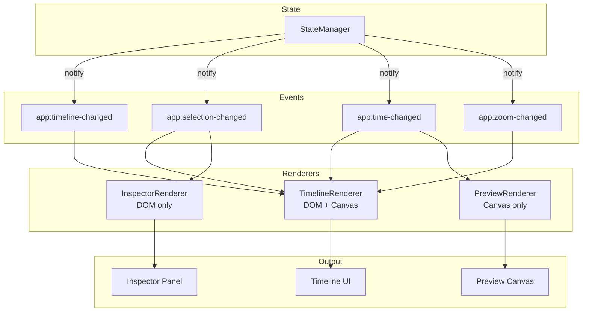
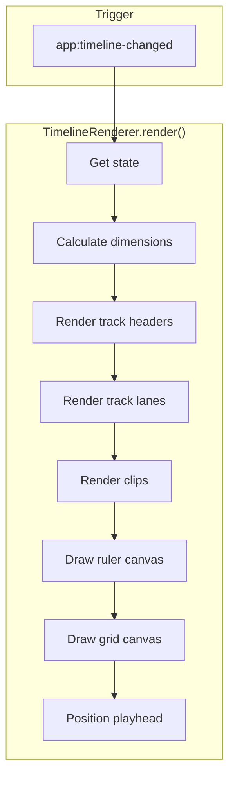
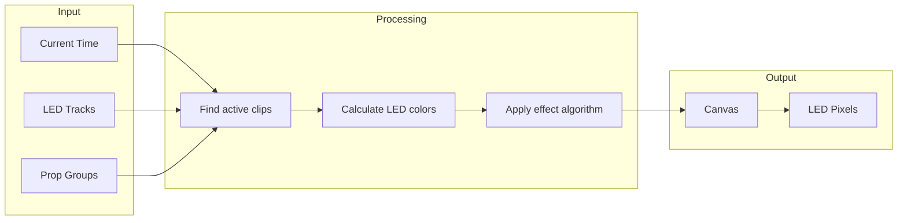
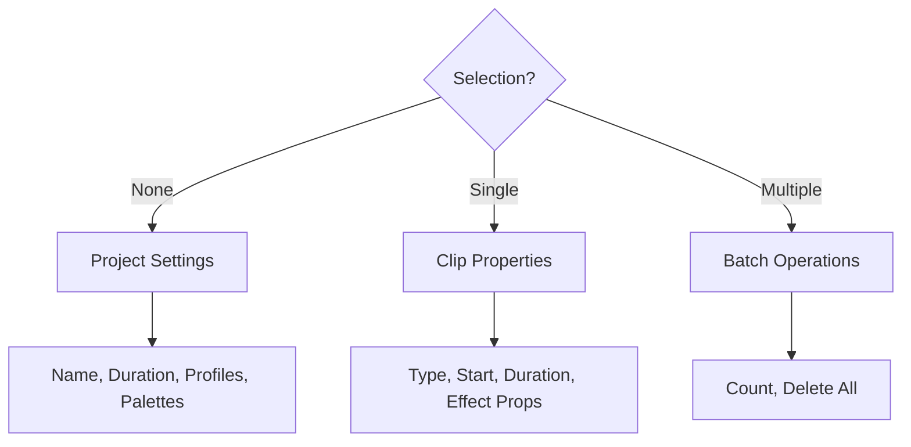
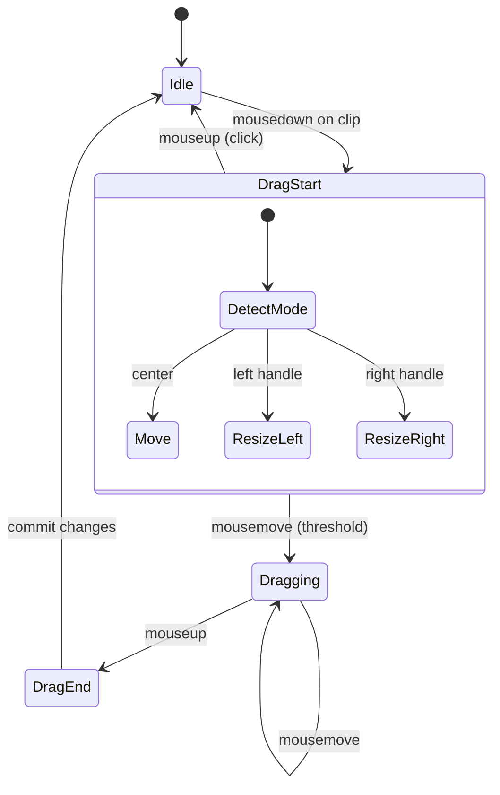

# Lesson 6: The Rendering Pipeline

## Learning Objectives

By the end of this lesson, you will be able to:
- Understand how TimelineRenderer draws tracks and clips
- Work with Canvas rendering in PreviewRenderer
- Implement DOM-based rendering in InspectorRenderer
- Apply performance optimization techniques
- Handle drag-and-drop interactions

---

## The Theater Stage Analogy

Think of our renderers like a theater production:

| Theater | Our App |
|---------|---------|
| **Script** | State data |
| **Stage Manager** | Renderer |
| **Actors** | DOM elements / Canvas pixels |
| **Stage** | Container elements |
| **Props** | Clips, tracks, controls |
| **Lighting Cues** | State change notifications |

When the script (state) changes, the stage manager (renderer) directs the actors (elements) to their new positions.

---

## The Rendering Architecture



---

## TimelineRenderer: The Complex One

TimelineRenderer is the most complex because it handles:
- Track headers (DOM)
- Track lanes with clips (DOM)
- Time ruler (Canvas)
- Grid background (Canvas)
- Waveforms (Canvas)
- Playhead (DOM + animation)

### Component Structure

```
timeline-container
├── track-headers (DOM)
│   └── track-header * N
│       ├── icon
│       ├── label (editable)
│       ├── group selector (dropdown)
│       └── delete button
│
├── timeline-scroll (DOM with scroll)
│   ├── ruler-canvas (Canvas)
│   ├── grid-overlay (Canvas)
│   ├── tracks-container (DOM)
│   │   └── track-lane * N
│   │       └── clip * N (DOM)
│   │           ├── clip-handle-left
│   │           ├── clip-content
│   │           └── clip-handle-right
│   └── playhead (DOM, absolutely positioned)
│
└── waveform-canvases (Canvas * N, one per audio clip)
```

### Rendering Flow



### The render() Method (Simplified)

```javascript
// TimelineRenderer.js

class TimelineRenderer {
    constructor(stateManager, container) {
        this.sm = stateManager;
        this.container = container;

        // Cache DOM references
        this.headersContainer = container.querySelector('.track-headers');
        this.tracksContainer = container.querySelector('.tracks-container');
        this.rulerCanvas = container.querySelector('.ruler-canvas');
        this.playhead = container.querySelector('.playhead');

        this.setupEventListeners();
    }

    setupEventListeners() {
        window.addEventListener('app:timeline-changed', () => this.render());
        window.addEventListener('app:zoom-changed', () => this.render());
        window.addEventListener('app:time-changed', () => this.updatePlayhead());
        window.addEventListener('app:selection-changed', () => this.updateSelection());
    }

    render() {
        const state = this.sm.getState();
        const { tracks } = state.project;
        const { zoom } = state.ui;

        // Calculate timeline width
        const pxPerMs = zoom / 1000;  // zoom is px/sec
        const duration = state.project.duration;
        const timelineWidth = duration * pxPerMs;

        // Set container width
        this.tracksContainer.style.width = `${timelineWidth}px`;

        // Render each track
        this.renderTrackHeaders(tracks);
        this.renderTrackLanes(tracks, state);

        // Render ruler and grid
        this.renderRuler(duration, pxPerMs);
        this.renderGrid(state.ui);
    }

    renderTrackHeaders(tracks) {
        // Clear existing
        this.headersContainer.innerHTML = '';

        tracks.forEach((track, index) => {
            const header = this.createTrackHeader(track, index);
            this.headersContainer.appendChild(header);
        });
    }

    createTrackHeader(track, index) {
        const header = document.createElement('div');
        header.className = `track-header track-header-${track.type}`;
        header.dataset.trackId = track.id;

        header.innerHTML = `
            <i class="fas ${track.type === 'led' ? 'fa-lightbulb' : 'fa-music'}"></i>
            <input type="text" class="track-label" value="${track.label}">
            ${track.type === 'led' ? this.createGroupSelector(track) : ''}
            <button class="track-delete" title="Delete track">
                <i class="fas fa-trash"></i>
            </button>
        `;

        // Wire up events
        header.querySelector('.track-delete').addEventListener('click', () => {
            window.dispatchEvent(new CustomEvent('app:delete-track', {
                detail: { trackId: track.id }
            }));
        });

        return header;
    }

    renderTrackLanes(tracks, state) {
        // Clear existing
        this.tracksContainer.innerHTML = '';

        const pxPerMs = state.ui.zoom / 1000;

        tracks.forEach(track => {
            const lane = this.createTrackLane(track, pxPerMs, state);
            this.tracksContainer.appendChild(lane);
        });
    }

    createTrackLane(track, pxPerMs, state) {
        const lane = document.createElement('div');
        lane.className = `track-lane track-lane-${track.type}`;
        lane.dataset.trackId = track.id;

        // Render each clip
        track.clips.forEach(clip => {
            const clipEl = this.createClipElement(clip, pxPerMs, state);
            lane.appendChild(clipEl);
        });

        return lane;
    }

    createClipElement(clip, pxPerMs, state) {
        const el = document.createElement('div');
        el.className = 'clip';
        el.dataset.clipId = clip.id;

        // Position and size
        el.style.left = `${clip.startTime * pxPerMs}px`;
        el.style.width = `${clip.duration * pxPerMs}px`;

        // Selection state
        if (state.selection.includes(clip.id)) {
            el.classList.add('selected');
        }

        // Color based on effect type
        const color = this.getClipColor(clip);
        el.style.backgroundColor = color;

        // Content
        el.innerHTML = `
            <div class="clip-handle clip-handle-left"></div>
            <div class="clip-content">
                <span class="clip-label">${clip.type}</span>
            </div>
            <div class="clip-handle clip-handle-right"></div>
        `;

        // Make focusable for accessibility
        el.setAttribute('tabindex', '0');
        el.setAttribute('role', 'button');
        el.setAttribute('aria-label', `${clip.type} clip at ${formatTime(clip.startTime)}`);

        return el;
    }
}
```

### Ruler Rendering (Canvas)

```javascript
// TimelineRenderer.js - continued

renderRuler(duration, pxPerMs) {
    const canvas = this.rulerCanvas;
    const ctx = canvas.getContext('2d');
    const width = duration * pxPerMs;

    // Set canvas size
    canvas.width = width;
    canvas.height = 24;

    // Clear
    ctx.clearRect(0, 0, width, 24);

    // Draw tick marks
    const majorInterval = this.getMajorTickInterval(pxPerMs);
    const minorInterval = majorInterval / 4;

    ctx.fillStyle = getComputedStyle(document.body).getPropertyValue('--ui-text');
    ctx.font = '10px system-ui';

    for (let ms = 0; ms <= duration; ms += minorInterval) {
        const x = ms * pxPerMs;
        const isMajor = ms % majorInterval === 0;

        // Draw tick
        ctx.beginPath();
        ctx.moveTo(x, isMajor ? 0 : 12);
        ctx.lineTo(x, 24);
        ctx.strokeStyle = isMajor ? 'var(--ui-text)' : 'var(--ui-text-faint)';
        ctx.stroke();

        // Draw label at major ticks
        if (isMajor) {
            ctx.fillText(formatTime(ms), x + 2, 10);
        }
    }
}

getMajorTickInterval(pxPerMs) {
    // Choose interval based on zoom level
    const pxPer1s = pxPerMs * 1000;
    if (pxPer1s >= 100) return 1000;   // 1 second
    if (pxPer1s >= 50) return 2000;    // 2 seconds
    if (pxPer1s >= 25) return 5000;    // 5 seconds
    return 10000;                       // 10 seconds
}
```

---

## PreviewRenderer: The LED Simulator

PreviewRenderer draws a simulation of the LED output:



### Preview Modes

| Mode | Description | Visual |
|------|-------------|--------|
| `track` | Linear LED strip per track | Horizontal rows of LEDs |
| `field` | 2D position grid | Props at x,y coordinates |
| `off` | Preview disabled | Empty |

### The Rendering Loop

```javascript
// PreviewRenderer.js - Simplified

class PreviewRenderer {
    constructor(stateManager, canvas) {
        this.sm = stateManager;
        this.canvas = canvas;
        this.ctx = canvas.getContext('2d');

        this.ledCount = 55;  // LEDs shown per track
        this.ledSize = 10;
        this.ledGap = 2;

        this.setupEventListeners();
    }

    setupEventListeners() {
        // Re-render on time change (during playback)
        window.addEventListener('app:time-changed', () => this.render());
        window.addEventListener('app:timeline-changed', () => this.render());
    }

    render() {
        const state = this.sm.getState();
        const { previewMode } = state.ui;

        if (previewMode === 'off') {
            this.clear();
            return;
        }

        if (previewMode === 'field') {
            this.renderFieldMode(state);
        } else {
            this.renderTrackMode(state);
        }
    }

    renderTrackMode(state) {
        const { tracks } = state.project;
        const currentTime = state.playback.currentTime;

        this.clear();

        // Filter to LED tracks only
        const ledTracks = tracks.filter(t => t.type === 'led');
        const trackHeight = this.ledSize + this.ledGap;

        ledTracks.forEach((track, trackIndex) => {
            const y = trackIndex * trackHeight;

            // Get active clips at current time
            const activeClips = track.clips.filter(clip =>
                currentTime >= clip.startTime &&
                currentTime < clip.startTime + clip.duration
            );

            // Render each LED
            for (let i = 0; i < this.ledCount; i++) {
                const x = i * (this.ledSize + this.ledGap);
                let color = '#000000';  // Default off

                // Calculate color from active effects
                activeClips.forEach(clip => {
                    const elapsed = currentTime - clip.startTime;
                    const progress = elapsed / clip.duration;
                    color = this.calculateEffectColor(clip, i, elapsed, progress);
                });

                this.drawLED(x, y, color);
            }
        });
    }

    calculateEffectColor(clip, ledIndex, elapsed, progress) {
        switch (clip.type) {
            case 'solid':
                return clip.props.color || '#ffffff';

            case 'rainbow':
                const hue = (ledIndex * 10 + elapsed * (clip.props.speed || 1) * 0.1) % 360;
                return `hsl(${hue}, 100%, 50%)`;

            case 'chase':
                const width = (clip.props.width || 0.2) * this.ledCount;
                const position = (elapsed * (clip.props.speed || 1) * 0.05) % this.ledCount;
                const distance = Math.abs(ledIndex - position);
                if (distance < width) {
                    return clip.props.color || '#ffffff';
                }
                return '#000000';

            case 'strobe':
                const rate = clip.props.rate || 10;
                const on = Math.floor(elapsed / (1000 / rate)) % 2 === 0;
                return on ? (clip.props.color || '#ffffff') : '#000000';

            // ... more effects

            default:
                return clip.props.color || '#ffffff';
        }
    }

    drawLED(x, y, color) {
        this.ctx.fillStyle = color;
        this.ctx.beginPath();
        this.ctx.arc(
            x + this.ledSize / 2,
            y + this.ledSize / 2,
            this.ledSize / 2,
            0,
            Math.PI * 2
        );
        this.ctx.fill();

        // Glow effect for bright colors
        if (this.isColorBright(color)) {
            this.ctx.shadowColor = color;
            this.ctx.shadowBlur = 8;
            this.ctx.fill();
            this.ctx.shadowBlur = 0;
        }
    }

    clear() {
        this.ctx.clearRect(0, 0, this.canvas.width, this.canvas.height);
    }
}
```

### Throttling for Performance

During playback, `app:time-changed` fires many times per second. We throttle:

```javascript
// PreviewRenderer.js

render() {
    // Throttle to ~60fps
    const now = Date.now();
    const lastRender = this.sm.get('lastPreviewRender') || 0;

    if (now - lastRender < 16) return;  // 16ms ≈ 60fps

    this.sm.update(draft => {
        draft.lastPreviewRender = now;
    }, { skipHistory: true });

    // ... actual rendering
}
```

**Pattern Alert!** Throttling is essential for smooth animations:
- `requestAnimationFrame` for vsync
- Time-based throttling for event handlers
- `setTimeout` debouncing for input

---

## InspectorRenderer: The Properties Panel

InspectorRenderer shows different content based on selection:



### Dynamic Form Generation

```javascript
// InspectorRenderer.js - Simplified

class InspectorRenderer {
    constructor(stateManager, container) {
        this.sm = stateManager;
        this.container = container;

        window.addEventListener('app:selection-changed', () => this.render());
        window.addEventListener('app:timeline-changed', () => this.render());
    }

    render() {
        const state = this.sm.getState();
        const { selection } = state;

        this.container.innerHTML = '';

        if (selection.length === 0) {
            this.renderProjectSettings(state);
        } else if (selection.length === 1) {
            const clip = this.findClip(selection[0], state);
            if (clip) this.renderClipProperties(clip, state);
        } else {
            this.renderMultiSelection(selection, state);
        }
    }

    renderProjectSettings(state) {
        const { project } = state;

        this.container.innerHTML = `
            <h3>Project Settings</h3>

            <div class="field-group">
                <label>Project Name</label>
                <input type="text" id="project-name" value="${project.name}">
            </div>

            <div class="field-group">
                <label>Duration (seconds)</label>
                <input type="number" id="project-duration"
                       value="${project.duration / 1000}"
                       min="1" max="3600">
            </div>

            <h4>Hardware Profiles</h4>
            <div id="profiles-list">
                ${this.renderProfilesList(project.settings.profiles)}
            </div>

            <h4>Prop Groups</h4>
            <div id="groups-list">
                ${this.renderGroupsList(project.propGroups)}
            </div>
        `;

        this.wireProjectEvents();
    }

    renderClipProperties(clip, state) {
        const effectFields = this.getEffectFields(clip.type);

        this.container.innerHTML = `
            <h3>${clip.type} Clip</h3>

            <div class="field-group">
                <label>Start Time (ms)</label>
                <input type="number" id="clip-start" value="${clip.startTime}" min="0">
            </div>

            <div class="field-group">
                <label>Duration (ms)</label>
                <input type="number" id="clip-duration" value="${clip.duration}" min="100">
            </div>

            ${effectFields}

            <button class="delete-btn" id="delete-clip">Delete Clip</button>
        `;

        this.wireClipEvents(clip.id);
    }

    getEffectFields(effectType) {
        // Each effect type has different parameters
        const fields = {
            solid: `
                <div class="field-group">
                    <label>Color</label>
                    <input type="color" id="prop-color">
                </div>
            `,
            rainbow: `
                <div class="field-group">
                    <label>Speed</label>
                    <input type="range" id="prop-speed" min="0.1" max="5" step="0.1">
                </div>
                <div class="field-group">
                    <label>Frequency</label>
                    <input type="range" id="prop-frequency" min="1" max="10">
                </div>
            `,
            chase: `
                <div class="field-group">
                    <label>Color</label>
                    <input type="color" id="prop-color">
                </div>
                <div class="field-group">
                    <label>Speed</label>
                    <input type="range" id="prop-speed" min="0.1" max="5" step="0.1">
                </div>
                <div class="field-group">
                    <label>Width</label>
                    <input type="range" id="prop-width" min="0.05" max="0.5" step="0.05">
                </div>
            `,
            // ... more effect types
        };

        return fields[effectType] || '';
    }

    wireClipEvents(clipId) {
        // Wire up all input fields to update state
        this.container.querySelectorAll('input').forEach(input => {
            input.addEventListener('change', () => {
                this.updateClipProperty(clipId, input);
            });
        });

        this.container.querySelector('#delete-clip')?.addEventListener('click', () => {
            window.dispatchEvent(new CustomEvent('app:delete-clip', {
                detail: { clipId }
            }));
        });
    }

    updateClipProperty(clipId, input) {
        const property = input.id.replace('prop-', '').replace('clip-', '');
        let value = input.type === 'number' ? parseFloat(input.value) : input.value;

        if (property === 'start' || property === 'duration') {
            // Update clip timing
            this.sm.update(draft => {
                const clip = this.findClipInDraft(draft, clipId);
                if (clip) {
                    if (property === 'start') clip.startTime = value;
                    if (property === 'duration') clip.duration = value;
                    draft.isDirty = true;
                }
            });
        } else {
            // Update clip props
            this.sm.update(draft => {
                const clip = this.findClipInDraft(draft, clipId);
                if (clip) {
                    clip.props[property] = value;
                    draft.isDirty = true;
                }
            });
        }

        window.dispatchEvent(new CustomEvent('app:timeline-changed'));
    }
}
```

---

## Drag and Drop Interactions

Timeline supports several drag operations:

### Clip Dragging (Move/Resize)



### Implementation

```javascript
// Timeline drag handling in main.js

let dragState = null;

function handleTimelineMouseDown(e) {
    const clip = e.target.closest('.clip');
    if (!clip) return;

    const handle = e.target.closest('.clip-handle');
    const rect = clip.getBoundingClientRect();

    dragState = {
        clipId: clip.dataset.clipId,
        mode: handle?.classList.contains('clip-handle-left') ? 'resize-left'
            : handle?.classList.contains('clip-handle-right') ? 'resize-right'
            : 'move',
        startX: e.clientX,
        startY: e.clientY,
        originalRect: rect,
        originalClip: getClipData(clip.dataset.clipId),
        hasMoved: false
    };

    document.addEventListener('mousemove', handleDrag);
    document.addEventListener('mouseup', handleDragEnd);
}

function handleDrag(e) {
    if (!dragState) return;

    const deltaX = e.clientX - dragState.startX;
    const deltaY = e.clientY - dragState.startY;

    // Movement threshold
    if (!dragState.hasMoved && Math.abs(deltaX) < 5 && Math.abs(deltaY) < 5) {
        return;
    }
    dragState.hasMoved = true;

    const clip = document.querySelector(`[data-clip-id="${dragState.clipId}"]`);
    const pxPerMs = stateManager.get('ui.zoom') / 1000;

    switch (dragState.mode) {
        case 'move':
            // Direct DOM manipulation for smooth feedback
            clip.style.transform = `translateX(${deltaX}px)`;
            break;

        case 'resize-left':
            const newLeft = dragState.originalRect.left + deltaX;
            const newWidth = dragState.originalRect.width - deltaX;
            clip.style.left = `${dragState.originalClip.startTime * pxPerMs + deltaX}px`;
            clip.style.width = `${Math.max(100, newWidth)}px`;
            break;

        case 'resize-right':
            clip.style.width = `${Math.max(100, dragState.originalRect.width + deltaX)}px`;
            break;
    }
}

function handleDragEnd(e) {
    if (!dragState || !dragState.hasMoved) {
        // Was a click, not a drag
        cleanup();
        return;
    }

    // Calculate final values
    const deltaX = e.clientX - dragState.startX;
    const pxPerMs = stateManager.get('ui.zoom') / 1000;
    const deltaMs = deltaX / pxPerMs;
    const snapGrid = stateManager.get('ui.snapEnabled')
        ? stateManager.get('ui.gridSize')
        : 1;

    // Commit to state
    stateManager.update(draft => {
        const clip = findClipInDraft(draft, dragState.clipId);
        if (!clip) return;

        switch (dragState.mode) {
            case 'move':
                clip.startTime = snapToGrid(
                    dragState.originalClip.startTime + deltaMs,
                    snapGrid
                );
                break;

            case 'resize-left':
                const newStart = snapToGrid(
                    dragState.originalClip.startTime + deltaMs,
                    snapGrid
                );
                const newDuration = dragState.originalClip.duration - (newStart - dragState.originalClip.startTime);
                clip.startTime = newStart;
                clip.duration = Math.max(100, newDuration);
                break;

            case 'resize-right':
                clip.duration = Math.max(100, snapToGrid(
                    dragState.originalClip.duration + deltaMs,
                    snapGrid
                ));
                break;
        }

        draft.isDirty = true;
    });

    window.dispatchEvent(new CustomEvent('app:timeline-changed'));
    cleanup();

    function cleanup() {
        document.removeEventListener('mousemove', handleDrag);
        document.removeEventListener('mouseup', handleDragEnd);
        dragState = null;
    }
}

function snapToGrid(value, grid) {
    return Math.round(value / grid) * grid;
}
```

---

## Performance Considerations

### 1. Direct DOM Manipulation During Drag

During drag operations, we **don't** update state on every mousemove. Instead:
- Manipulate the DOM directly (`transform`, `style.left`)
- Only commit to state on mouseup

This avoids re-rendering the entire timeline 60 times per second.

### 2. Canvas vs DOM

| Use Case | Technology | Why |
|----------|------------|-----|
| Interactive clips | DOM | Click handling, accessibility |
| Ruler tick marks | Canvas | Many elements, no interaction |
| Preview LEDs | Canvas | Custom drawing, animation |
| Waveforms | Canvas | Dense data visualization |

### 3. Virtualization (Future Consideration)

For very long timelines with many clips, we could virtualize:
- Only render clips visible in the viewport
- Recycle DOM elements when scrolling

Currently not needed, but the pattern would be:
```javascript
const visibleRange = getVisibleTimeRange();
const visibleClips = clips.filter(c =>
    c.startTime + c.duration > visibleRange.start &&
    c.startTime < visibleRange.end
);
```

---

## Accessibility in Rendering

### Keyboard Navigation for Clips

```javascript
// Clips are focusable
clipElement.setAttribute('tabindex', '0');
clipElement.setAttribute('role', 'button');
clipElement.setAttribute('aria-label', `${clip.type} clip at ${formatTime(clip.startTime)}`);

// Arrow keys for navigation
document.addEventListener('keydown', (e) => {
    const focused = document.activeElement;
    if (!focused?.classList.contains('clip')) return;

    if (e.key === 'Tab') {
        // Tab moves to next/prev clip
        const clips = [...document.querySelectorAll('.clip')];
        const index = clips.indexOf(focused);
        const next = e.shiftKey ? clips[index - 1] : clips[index + 1];
        if (next) {
            e.preventDefault();
            next.focus();
        }
    }

    if (e.key === 'ArrowLeft' || e.key === 'ArrowRight') {
        // Arrow keys nudge position
        e.preventDefault();
        nudgeClip(focused.dataset.clipId, e.key === 'ArrowLeft' ? -1 : 1);
    }
});
```

---

## Exercise: Add a Visual Effect

Add a "glow" effect to selected clips:

1. Find where clips are rendered in TimelineRenderer
2. Add a CSS class when selected
3. Create the glow effect in CSS

<details>
<summary>Solution</summary>

```javascript
// In createClipElement()
if (state.selection.includes(clip.id)) {
    el.classList.add('selected');
}
```

```css
/* In style.css */
.clip.selected {
    box-shadow: 0 0 10px 2px var(--ui-accent);
    z-index: 10;
}
```
</details>

---

## Summary

### Key Takeaways

1. **DOM vs Canvas** - Choose based on interactivity needs
2. **Direct Manipulation** - Fast feedback during drag operations
3. **State Commit on End** - Only update state when interaction completes
4. **Throttling** - Essential for smooth animation
5. **Event-Driven Updates** - Renderers respond to events, not direct calls

### The Mental Model

Renderers are **painters**:
- They read the script (state)
- They paint the scene (DOM/Canvas)
- They don't write the script (no state mutations)
- They update when cued (events)

---

## Next Lesson

In [Lesson 7: Binary Format & Serialization](07-binary-format.md), we'll explore:
- The .lum project file format (ZIP)
- The show.bin binary format for hardware
- How data is serialized for the Pico
- PropConfig LUT and event structures

---

[← Controllers](05-controllers.md) | [Course Index](README.md) | [Binary Format →](07-binary-format.md)
