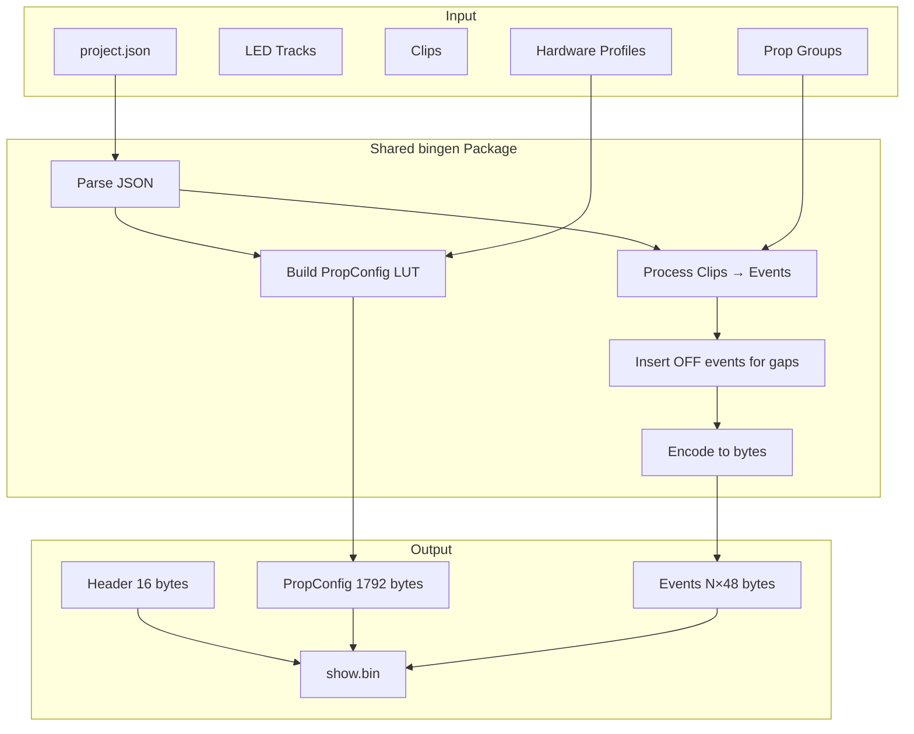
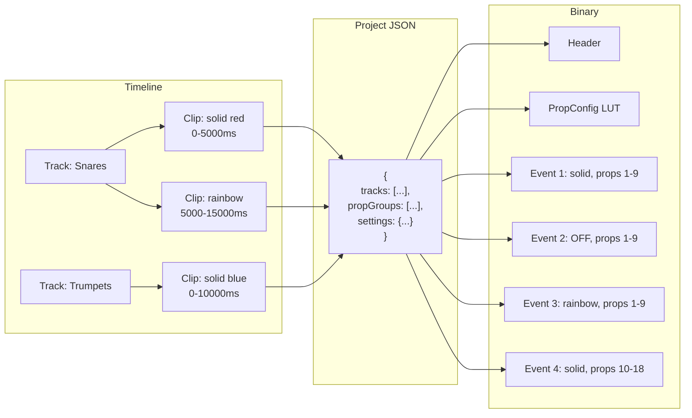

# Binary Format & Serialization

This document explains the binary file formats used in PicoLume Studio: the `.lum` project format and the `show.bin` hardware format.

---

## Format Overview

| Format | Analogy | Use Case |
|--------|---------|----------|
| **JSON (in memory)** | Your thoughts | Working data in JavaScript |
| **.lum (ZIP)** | Written document | Saving projects for humans |
| **show.bin** | Machine code | Instructions for hardware |

Each format serves a different purpose. We translate between them as needed.

---

## The .lum Project Format

### What Is It?

A `.lum` file is a **ZIP archive** containing:

```
myshow.lum (ZIP)
├── project.json        # All project data as JSON
└── audio/
    ├── audio_abc123.mp3  # Audio files embedded
    └── audio_def456.wav
```

### Why ZIP?

| Alternative | Problem |
|-------------|---------|
| Single JSON | Can't embed binary audio data efficiently |
| Base64 in JSON | File size bloats 33% |
| Folder of files | Users lose files when moving |
| Custom binary | Not human-readable for debugging |

ZIP gives us:
- Compression (smaller files)
- Multiple files in one
- Standard format (no custom parsers needed)
- Can open with any zip tool to debug

### Safety Limits (Zip Bomb Protection)

To prevent malicious or accidental “zip bomb” projects from freezing/crashing the app, Studio enforces limits when loading `.lum` files (desktop and online):

- Max `.lum` size: **500 MB**
- Max `project.json`: **10 MB**
- Max single audio file: **200 MB**
- Max total extracted size: **1 GB**
- Max files in archive: **100**

### project.json Structure

```json
{
  "version": "0.2.2",
  "name": "My Show",
  "duration": 60000,
  "settings": {
    "profiles": [
      {
        "id": "p_default",
        "name": "Standard Prop",
        "assignedIds": "1-18",
        "ledCount": 164,
        "ledType": 0,
        "colorOrder": 0,
        "brightnessCap": 255,
        "voltage": 5
      }
    ],
    "patch": {},
    "fieldLayout": {},
    "palettes": []
  },
  "propGroups": [
    {
      "id": "g_all",
      "name": "All Props",
      "ids": "1-18"
    }
  ],
  "tracks": [
    {
      "id": "t_audio",
      "type": "audio",
      "label": "Audio Track",
      "clips": [
        {
          "id": "c_audio_1",
          "type": "audio",
          "startTime": 0,
          "duration": 30000,
          "bufferId": "audio_abc123",
          "props": {
            "name": "song.mp3",
            "volume": 1.0
          }
        }
      ]
    },
    {
      "id": "t_led",
      "type": "led",
      "label": "Main Effects",
      "groupId": "g_all",
      "clips": [
        {
          "id": "c_solid_1",
          "type": "solid",
          "startTime": 0,
          "duration": 5000,
          "props": {
            "color": "#ff0000"
          }
        },
        {
          "id": "c_rainbow_1",
          "type": "rainbow",
          "startTime": 5000,
          "duration": 10000,
          "props": {
            "speed": 1.5,
            "frequency": 3
          }
        }
      ]
    }
  ]
}
```

### Saving a Project (Go Side)

```go
// app.go - SaveProjectToPath (simplified)

func (a *App) SaveProjectToPath(path string, projectJson string, audioFiles map[string]string) string {
    // 1. Validate path
    cleanPath, err := validateSavePath(path, []string{".lum"})
    if err != nil {
        return "Error: " + err.Error()
    }

    // 2. Create output file
    file, err := os.Create(cleanPath)
    if err != nil {
        return "Error: " + err.Error()
    }
    defer file.Close()

    // 3. Create ZIP writer
    zipWriter := zip.NewWriter(file)
    defer zipWriter.Close()

    // 4. Write project.json
    jsonWriter, _ := zipWriter.Create("project.json")
    jsonWriter.Write([]byte(projectJson))

    // 5. Write audio files
    for bufferId, dataUrl := range audioFiles {
        // Parse data URL: "data:audio/mp3;base64,AAAA..."
        parts := strings.Split(dataUrl, ",")
        if len(parts) != 2 {
            continue
        }

        // Detect extension from MIME type
        ext := ".bin"
        if strings.Contains(parts[0], "mp3") {
            ext = ".mp3"
        } else if strings.Contains(parts[0], "wav") {
            ext = ".wav"
        }

        // Decode base64
        data, _ := base64.StdEncoding.DecodeString(parts[1])

        // Write to ZIP
        audioWriter, _ := zipWriter.Create("audio/" + bufferId + ext)
        audioWriter.Write(data)
    }

    return "Saved"
}
```

---

## The show.bin Binary Format

### Why Binary?

The Pico (RP2040) has:
- 2MB flash
- 264KB RAM
- No JSON parser (would use too much memory)

Binary format gives us:
- Tiny file size
- Direct memory mapping
- Fast parsing (just read bytes)
- Predictable structure

### Format Overview (V3)

```
┌──────────────────────────────────────────────────────────┐
│                      HEADER (16 bytes)                    │
├──────────────────────────────────────────────────────────┤
│  0x00-0x03: Magic "PICO" (0x5049434F)                    │
│  0x04-0x05: Version (3)                                  │
│  0x06-0x07: Event count                                  │
│  0x08-0x0F: Reserved                                     │
├──────────────────────────────────────────────────────────┤
│                 PROPCONFIG LUT (1792 bytes)               │
│              224 props × 8 bytes each                     │
├──────────────────────────────────────────────────────────┤
│                     EVENTS (48 bytes each)                │
│                     N events...                           │
└──────────────────────────────────────────────────────────┘
```

### Header Structure

Optional: a 32-byte `CUE1` block may be appended after the events section (see below).

```
Offset  Size  Field           Description
------  ----  -----           -----------
0x00    4     magic           "PICO" in ASCII (0x5049434F)
0x04    2     version         Format version (currently 3)
0x06    2     eventCount      Number of events
0x08    8     reserved        Future use (zeros)
```

### PropConfig LUT (Look-Up Table)

Each prop (1-224) has 8 bytes of configuration:

```
Offset  Size  Field           Description
------  ----  -----           -----------
0x00    2     ledCount        Number of LEDs on this prop
0x02    1     ledType         LED chipset (see below)
0x03    1     colorOrder      Color byte order (see below)
0x04    1     brightnessCap   Maximum brightness (0-255)
0x05    3     reserved        Future use
```

**LED Types:**
```
0 = WS2812B (most common)
1 = SK6812
2 = SK6812_RGBW
3 = WS2811
4 = WS2813
5 = WS2815
```

**Color Orders:**
```
0 = GRB (most common for WS2812B)
1 = RGB
2 = BRG
3 = RBG
4 = GBR
5 = BGR
```

### Event Structure

Each event is 48 bytes:

```
Offset  Size  Field           Description
------  ----  -----           -----------
0x00    4     startTime       Start time in milliseconds
0x04    4     duration        Duration in milliseconds
0x08    1     effectCode      Effect type (see below)
0x09    1     speed           Speed parameter (0-255)
0x0A    1     width           Width parameter (0-255)
0x0B    1     reserved        Padding
0x0C    4     color           Primary color (0x00RRGGBB)
0x10    4     color2          Secondary color (0x00RRGGBB)
0x14    28    propMask        Bitfield for props 1-224 (7 × uint32)
```

### Optional Cue Block (CUE1 trailer)

If a project defines cue points (A-D), Studio appends a 32-byte cue block to the end of `show.bin`. Receivers ignore trailing bytes; the remote reads the last 32 bytes and checks for the `CUE1` magic.

Cue block layout (little-endian):

```
Offset  Size  Field           Description
------  ----  -----           -----------
0x00    4     magic           "CUE1" (bytes 43 55 45 31)
0x04    2     version         1
0x06    2     count           4
0x08    16    times[4]        Cue A-D times in ms (u32); 0xFFFFFFFF = unused
0x18    8     reserved        Future use (zeros)
```

**Effect Codes:**
```
1  = solid
2  = flash
3  = strobe
4  = rainbow
5  = rainbowHold
6  = chase
9  = wipe
10 = scanner
11 = meteor
12 = fire
13 = heartbeat
14 = glitch
15 = energy
16 = sparkle
17 = breathe
18 = alternate
```

### The Prop Mask

The prop mask is a **bitfield** - each bit represents one prop:

```
propMask[0] bits 0-31  → props 1-32
propMask[1] bits 0-31  → props 33-64
propMask[2] bits 0-31  → props 65-96
propMask[3] bits 0-31  → props 97-128
propMask[4] bits 0-31  → props 129-160
propMask[5] bits 0-31  → props 161-192
propMask[6] bits 0-31  → props 193-224
```

To check if prop N should play this event:
```go
index := (N - 1) / 32
bit := (N - 1) % 32
isActive := (propMask[index] >> bit) & 1 == 1
```

---

## Binary Generation Flow



### Architecture: Single Source of Truth

Binary generation is implemented once in Go and shared across all environments:

```
┌─────────────────────┐     ┌─────────────────────┐
│   Wails Desktop     │     │   Web Browser       │
│   (app.go)          │     │   (JavaScript)      │
└────────┬────────────┘     └────────┬────────────┘
         │                           │
         ▼                           ▼
┌─────────────────────┐     ┌─────────────────────┐
│  bingen package     │     │  bingen.wasm        │
│  (native Go)        │     │  (Go→WebAssembly)   │
└─────────────────────┘     └─────────────────────┘
         │                           │
         └───────────┬───────────────┘
                     ▼
           Single Source of Truth
           (bingen/bingen.go)
```

**Why this architecture?**
- **Consistency**: Same binary output regardless of environment
- **Maintainability**: One codebase to update when format changes
- **Testing**: Test once, trust everywhere

### The Go Implementation

Binary generation lives in the shared `bingen` package (`bingen/bingen.go`):

```go
// bingen/bingen.go - Shared binary generation package

package bingen

// GenerateFromJSON generates show.bin bytes from project JSON string.
func GenerateFromJSON(projectJSON string) (*Result, error) {
    var p Project
    if err := json.Unmarshal([]byte(projectJSON), &p); err != nil {
        return nil, err
    }
    return Generate(&p)
}

// Generate creates show.bin bytes from a Project struct.
func Generate(p *Project) (*Result, error) {
    // 1. Build prop → profile mapping
    // 2. Generate PropConfig LUT (1792 bytes)
    // 3. Process clips into events with gap-filling
    // 4. Encode header + LUT + events
    // 5. Append CUE block if cues exist
    // ... (see bingen/bingen.go for full implementation)
}
```

The desktop app (`app.go`) wraps the shared package:

```go
// app.go - Uses shared bingen package

import "PicoLume/bingen"

func generateBinaryBytes(projectJSON string) ([]byte, int, error) {
    result, err := bingen.GenerateFromJSON(projectJSON)
    if err != nil {
        return nil, 0, err
    }
    return result.Bytes, result.EventCount, nil
}
```

### WebAssembly Build

The same `bingen` package compiles to WebAssembly for browser use:

```go
// wasm/main.go - WASM entry point
//go:build js && wasm

package main

import (
    "syscall/js"
    "PicoLume/bingen"
)

func generateBinaryBytes(this js.Value, args []js.Value) interface{} {
    projectJSON := args[0].String()
    result, err := bingen.GenerateFromJSON(projectJSON)
    if err != nil {
        return map[string]interface{}{"error": err.Error()}
    }

    uint8Array := js.Global().Get("Uint8Array").New(len(result.Bytes))
    js.CopyBytesToJS(uint8Array, result.Bytes)
    return map[string]interface{}{
        "bytes":      uint8Array,
        "eventCount": result.EventCount,
    }
}

func main() {
    picolume := js.Global().Get("Object").New()
    picolume.Set("generateBinaryBytes", js.FuncOf(generateBinaryBytes))
    js.Global().Set("picolume", picolume)
    select {} // Keep alive
}
```

Build the WASM module:
```bash
npm run build:wasm
# or
.\scripts\build-wasm.ps1
```

### Helper Functions

```go
// Parse "1-18" or "1,5,7" into []int
func parseIDRange(ids string) []int {
    var result []int
    for _, part := range strings.Split(ids, ",") {
        part = strings.TrimSpace(part)
        if strings.Contains(part, "-") {
            bounds := strings.Split(part, "-")
            start, _ := strconv.Atoi(bounds[0])
            end, _ := strconv.Atoi(bounds[1])
            for i := start; i <= end; i++ {
                if i >= 1 && i <= 224 {
                    result = append(result, i)
                }
            }
        } else {
            id, _ := strconv.Atoi(part)
            if id >= 1 && id <= 224 {
                result = append(result, id)
            }
        }
    }
    return result
}

// Build 7×uint32 prop mask
func calculateMask(idStr string) [7]uint32 {
    var mask [7]uint32
    for _, id := range parseIDRange(idStr) {
        index := (id - 1) / 32
        bit := uint32((id - 1) % 32)
        mask[index] |= (1 << bit)
    }
    return mask
}
```

---

## Reading Binary (Binary Inspector)

The frontend includes a Binary Inspector tool to verify exported files:

```javascript
// ShowBinParser.js - Simplified

export function parseShowBin(arrayBuffer) {
    const view = new DataView(arrayBuffer);
    let offset = 0;

    // === HEADER ===
    const magic = String.fromCharCode(
        view.getUint8(0), view.getUint8(1),
        view.getUint8(2), view.getUint8(3)
    );

    if (magic !== 'PICO') {
        throw new Error('Invalid magic number');
    }

    const version = view.getUint16(4, true);  // true = little endian
    const eventCount = view.getUint16(6, true);
    offset = 16;

    // === PROPCONFIG LUT ===
    const propConfigs = [];
    for (let i = 0; i < 224; i++) {
        propConfigs.push({
            propId: i + 1,
            ledCount: view.getUint16(offset, true),
            ledType: view.getUint8(offset + 2),
            colorOrder: view.getUint8(offset + 3),
            brightnessCap: view.getUint8(offset + 4)
        });
        offset += 8;
    }

    // === EVENTS ===
    const events = [];
    for (let i = 0; i < eventCount; i++) {
        const startTime = view.getUint32(offset, true);
        const duration = view.getUint32(offset + 4, true);
        const effectCode = view.getUint8(offset + 8);
        const speed = view.getUint8(offset + 9);
        const width = view.getUint8(offset + 10);
        const color = view.getUint32(offset + 12, true);
        const color2 = view.getUint32(offset + 16, true);

        // Read prop mask
        const propMask = [];
        for (let j = 0; j < 7; j++) {
            propMask.push(view.getUint32(offset + 20 + j * 4, true));
        }

        // Convert mask to prop IDs
        const propIds = [];
        for (let propId = 1; propId <= 224; propId++) {
            const index = Math.floor((propId - 1) / 32);
            const bit = (propId - 1) % 32;
            if ((propMask[index] >> bit) & 1) {
                propIds.push(propId);
            }
        }

        events.push({
            index: i,
            startTime,
            duration,
            effectCode,
            effectName: codeToEffectName(effectCode),
            speed,
            width,
            color: '#' + (color & 0xFFFFFF).toString(16).padStart(6, '0'),
            color2: '#' + (color2 & 0xFFFFFF).toString(16).padStart(6, '0'),
            propIds
        });

        offset += 48;
    }

    return {
        magic,
        version,
        eventCount,
        propConfigs: propConfigs.filter(p => p.ledCount > 0),
        events,
        fileSize: arrayBuffer.byteLength,
        duration: events.length > 0
            ? Math.max(...events.map(e => e.startTime + e.duration))
            : 0
    };
}
```

---

## Data Flow Visualization



### Why Insert OFF Events?

Without OFF events, LEDs would stay on between clips. The firmware is event-driven:
- No event = no change
- OFF event = turn LEDs off

---

## Endianness: Little vs Big

Binary data has byte order. We use **little-endian** (LE):

```
Number: 0x1234 (4660 in decimal)

Big-endian:    [0x12][0x34]  (most significant byte first)
Little-endian: [0x34][0x12]  (least significant byte first)
```

Why little-endian?
- x86/x64 processors are little-endian
- ARM (including RP2040) is little-endian
- Wails runs on x86/x64

**Critical:** When reading/writing binary, always specify endianness:
```javascript
view.getUint32(offset, true)   // true = little-endian
view.getUint32(offset, false)  // false = big-endian
```

---

## File Size Calculation

Formula: `16 + 1792 + (eventCount × 48)`

Example with 50 events:
```
Header:        16 bytes
PropConfig:    224 × 8 = 1,792 bytes
Events:        50 × 48 = 2,400 bytes
─────────────────────────────────────
Total:         4,208 bytes (4.1 KB)
```

---

## Validation Checks

The Binary Inspector performs these validation checks:

| Check | Warning |
|-------|---------|
| Version ≠ 3 | "Unsupported version" |
| Overlapping events | "Event X overlaps with Y" |
| Zero-duration events | "Event X has zero duration" |
| Events targeting no props | "Event X targets no props" |
| Targeting unconfigured props | "Event X targets prop Y with no config" |

---

## Summary

### Key Takeaways

1. **.lum = ZIP** - Human-readable, debuggable
2. **show.bin = Binary** - Compact, fast to parse on hardware
3. **PropConfig LUT** - Per-prop hardware settings
4. **Events are clips** - Timeline clips become binary events
5. **OFF events fill gaps** - Ensure LEDs turn off between clips
6. **Little-endian** - Byte order matches hardware

### The Mental Model

Think of serialization as **translation**:

```
Developer language (JSON)
       ↓ translate
Computer language (binary)
       ↓ upload
Hardware executes
```

Each format is optimized for its reader.

---

[← Rendering Pipeline](06-rendering-pipeline.md) | [Index](README.md) | [Backend API Reference →](08-backend-api-reference.md)
