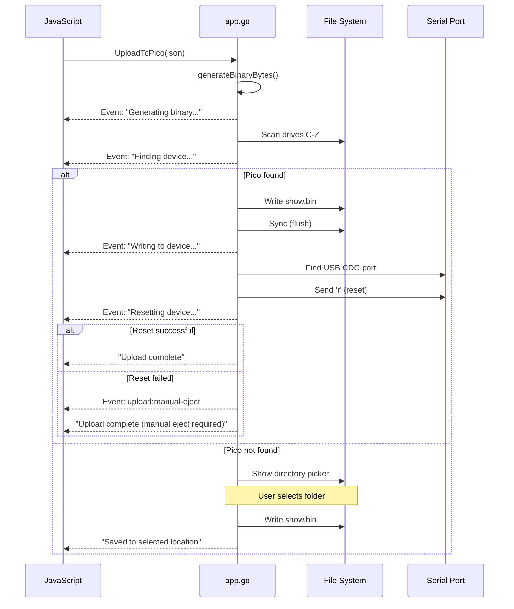

# Lesson 8: Backend API Reference

## Learning Objectives

By the end of this lesson, you will be able to:
- Know every Go function available from JavaScript
- Understand parameters, return values, and error handling
- Choose the right function for each task
- Work with the Backend adapter pattern

---

## Quick Reference

### Function Summary Table

| Function | Purpose | Returns | Desktop | Online |
|----------|---------|---------|---------|----------|
| `RequestSavePath()` | Get save path from user | `string` | Yes | No |
| `SaveProjectToPath()` | Save .lum project | `string` | Yes | No |
| `LoadProject()` | Load .lum project | `LoadResponse` | Yes | No |
| `SaveBinary()` | Export show.bin (deprecated) | `string` | Yes | No |
| `SaveBinaryData()` | Save pre-generated binary | `string` | Yes | No |
| `UploadToPico()` | Generate + upload to device | `string` | Yes | No |
| `GetPicoConnectionStatus()` | Check device connection | `PicoConnectionStatus` | Yes | No |

---

## Detailed API Reference

### RequestSavePath()

**Purpose:** Open native file save dialog to get a file path from the user.

**Signature:**
```go
func (a *App) RequestSavePath() string
```

**Parameters:** None

**Returns:**
- `string` - File path selected by user, or empty string if cancelled

**JavaScript Usage:**
```javascript
const path = await window.go.main.App.RequestSavePath();
if (path) {
    // User selected a path
    await SaveProjectToPath(path, json, audio);
} else {
    // User cancelled
}
```

**When to Use:**
- Before first save (no existing path)
- For "Save As" functionality
- When you need user to choose destination

**Notes:**
- Default filename: `"myshow.lum"`
- Filter: `*.lum` files only

---

### SaveProjectToPath(path, projectJson, audioFiles)

**Purpose:** Save a complete project to disk as a .lum (ZIP) file.

**Signature:**
```go
func (a *App) SaveProjectToPath(path string, projectJson string, audioFiles map[string]string) string
```

**Parameters:**

| Parameter | Type | Description |
|-----------|------|-------------|
| `path` | `string` | Absolute file path (must end in `.lum`) |
| `projectJson` | `string` | JSON string of project data |
| `audioFiles` | `map[string]string` | Map of bufferId → data URL |

**Returns:**
- `"Saved"` on success
- `"Error: ..."` on failure

**JavaScript Usage:**
```javascript
const project = stateManager.get('project');
const audioLibrary = stateManager.get('audioLibrary');

const result = await window.go.main.App.SaveProjectToPath(
    '/path/to/myshow.lum',
    JSON.stringify(project),
    audioLibrary
);

if (result === 'Saved') {
    // Success
} else {
    // result contains error message
    console.error(result);
}
```

**Security:**
- Path is validated (must be absolute, must end in `.lum`)
- Directory traversal prevented
- Invalid paths rejected with error

**What Gets Saved:**
```
myshow.lum (ZIP)
├── project.json
└── audio/
    ├── audio_abc123.mp3
    └── audio_def456.wav
```

---

### LoadProject()

**Purpose:** Open file picker and load a .lum project file.

**Signature:**
```go
func (a *App) LoadProject() LoadResponse
```

**Parameters:** None

**Returns:** `LoadResponse` struct:

```go
type LoadResponse struct {
    ProjectJson string            `json:"projectJson"`
    AudioFiles  map[string]string `json:"audioFiles"`
    FilePath    string            `json:"filePath"`
    Error       string            `json:"error"`
}
```

**JavaScript Usage:**
```javascript
const response = await window.go.main.App.LoadProject();

if (response.error) {
    console.error('Load failed:', response.error);
    return;
}

// Parse project JSON
const project = JSON.parse(response.projectJson);

// Load audio files
for (const [bufferId, dataUrl] of Object.entries(response.audioFiles)) {
    await audioService.loadAudioFromDataURL(bufferId, dataUrl);
}

// Update state
stateManager.replaceState({
    project,
    filePath: response.filePath,
    isDirty: false,
    // ...
}, { clearHistory: true });
```

**Security Limits:**
- Max ZIP size: 500 MB
- Max files in ZIP: 100
- Max project.json: 10 MB
- Max audio file: 200 MB
- Max total extracted: 1 GB

**File Selection:**
- Shows native file picker
- Filter: `*.lum` files
- Returns empty response if cancelled

---

### SaveBinary(projectJson) [DEPRECATED]

**Purpose:** Generate binary from project and save to user-selected location.

**Signature:**
```go
func (a *App) SaveBinary(projectJson string) string
```

**Status:** Deprecated - Use `SaveBinaryData()` instead.

**Why Deprecated:**
- Frontend now generates binary (BinaryGenerator.js)
- More flexibility in binary generation
- Easier to add frontend validation

---

### SaveBinaryData(base64Data)

**Purpose:** Save pre-generated binary data (from frontend) to user-selected file.

**Signature:**
```go
func (a *App) SaveBinaryData(base64Data string) string
```

**Parameters:**

| Parameter | Type | Description |
|-----------|------|-------------|
| `base64Data` | `string` | Binary data encoded as base64 |

**Returns:**
- `"OK"` on success
- `"Error: ..."` on failure

**JavaScript Usage:**
```javascript
import { generateBinary } from './core/BinaryGenerator.js';

// Generate binary in JavaScript
const binaryBytes = generateBinary(projectJson);

// Encode as base64
const base64 = btoa(String.fromCharCode(...new Uint8Array(binaryBytes)));

// Save via backend
const result = await window.go.main.App.SaveBinaryData(base64);

if (result === 'OK') {
    // Success
}
```

**Notes:**
- Opens native save dialog
- Default filename: `show.bin`
- User can choose any location

---

### UploadToPico(projectJson)

**Purpose:** Generate binary and upload directly to connected Pico device.

**Signature:**
```go
func (a *App) UploadToPico(projectJson string) string
```

**Parameters:**

| Parameter | Type | Description |
|-----------|------|-------------|
| `projectJson` | `string` | JSON string of project data |

**Returns:**
- Success message on completion
- `"Error: ..."` on failure

**Events Emitted:**

| Event | Data | Description |
|-------|------|-------------|
| `upload:status` | `string` | Progress message |
| `upload:manual-eject` | `bool` | Whether manual eject needed |

**JavaScript Usage:**
```javascript
import { EventsOn } from './wailsjs/runtime/runtime.js';

// Listen for progress
EventsOn('upload:status', (message) => {
    statusBar.innerText = message;
});

// Listen for manual eject
EventsOn('upload:manual-eject', (required) => {
    if (required) {
        showDialog('Please safely eject the Pico drive before unplugging.');
    }
});

// Start upload
const project = stateManager.get('project');
const result = await window.go.main.App.UploadToPico(JSON.stringify(project));
```

**Upload Sequence:**



**Device Detection:**
- Scans Windows drives D-Z
- Looks for `INDEX.HTM` or `show.bin` (indicates Pico in USB mode)
- Skips drives with `INFO_UF2.TXT` (bootloader mode)

**Serial Reset:**
- Finds USB CDC serial port by VID
- Known VIDs: Raspberry Pi (0x2E8A), Adafruit (0x239A), SparkFun (0x1B4F)
- Sends `'r'` character at 115200 baud
- Retries up to 3 times per port

---

### GetPicoConnectionStatus()

**Purpose:** Get current device connection status for status bar.

**Signature:**
```go
func (a *App) GetPicoConnectionStatus() PicoConnectionStatus
```

**Parameters:** None

**Returns:** `PicoConnectionStatus` struct:

```go
type PicoConnectionStatus struct {
    Connected        bool   `json:"connected"`
    Mode             string `json:"mode"`
    USBDrive         string `json:"usbDrive"`
    SerialPort       string `json:"serialPort"`
    SerialPortLocked bool   `json:"serialPortLocked"`
}
```

**Mode Values:**

| Mode | Description |
|------|-------------|
| `"NONE"` | No device detected |
| `"USB"` | USB mass storage only |
| `"SERIAL"` | Serial port only |
| `"USB+SERIAL"` | Both USB and serial |
| `"BOOTLOADER"` | Pico in UF2 bootloader mode |

**JavaScript Usage:**
```javascript
// Poll status periodically
setInterval(async () => {
    const status = await window.go.main.App.GetPicoConnectionStatus();

    if (status.connected) {
        statusIndicator.className = 'connected';
        statusText.innerText = `Connected: ${status.mode}`;

        if (status.usbDrive) {
            statusText.innerText += ` (${status.usbDrive})`;
        }

        if (status.serialPortLocked) {
            statusText.innerText += ' [Port in use]';
        }
    } else {
        statusIndicator.className = 'disconnected';
        statusText.innerText = 'Not connected';
    }
}, 1500);  // Every 1.5 seconds
```

**Notes:**
- Designed for frequent polling (lightweight)
- Tries to open serial port to detect if locked
- USB detection faster than serial enumeration

---

## Using the Backend Adapter

The Backend adapter (`core/Backend.js`) provides a unified interface:

```javascript
// Backend.js

import { getBackend } from './core/Backend.js';

const backend = getBackend();

// Check capabilities
if (backend.capabilities.canUpload) {
    // Upload button enabled
}

// Use methods
const path = await backend.requestSavePath();
const result = await backend.saveProjectToPath(path, json, audio);
const response = await backend.loadProject();
```

### Capability Flags

| Capability | Desktop | Online |
|------------|---------|----------|
| `canSave` | Yes | Yes (File System Access API) |
| `canLoad` | Yes | Yes (file picker) |
| `canExport` | Yes | No |
| `canUpload` | Yes | No |
| `canCheckConnection` | Yes | No |

### Environment Detection

```javascript
function getBackend() {
    if (window.go?.main?.App) {
        return new WailsBackend();
    }
    return new OnlineBackend();
}
```

---

## Error Handling Patterns

### Pattern 1: String Error Returns

Most functions return error messages as strings:

```javascript
const result = await SaveProjectToPath(path, json, audio);

if (result.startsWith('Error')) {
    ErrorHandler.show(result, 'error');
    return;
}

// Success
ErrorHandler.show('Project saved', 'success');
```

### Pattern 2: Struct with Error Field

LoadProject returns a struct with an error field:

```javascript
const response = await LoadProject();

if (response.error) {
    ErrorHandler.show(response.error, 'error');
    return;
}

// Success - use response.projectJson, response.audioFiles
```

### Pattern 3: Event-Based Errors

Upload errors may come via events:

```javascript
EventsOn('upload:status', (message) => {
    if (message.toLowerCase().includes('error')) {
        ErrorHandler.show(message, 'error');
    } else {
        statusBar.innerText = message;
    }
});
```

---

## Common Workflows

### Save Project

```javascript
async function saveProject(forceSaveAs = false) {
    const backend = getBackend();

    // Get or request path
    let path = stateManager.get('filePath');
    if (!path || forceSaveAs) {
        path = await backend.requestSavePath();
        if (!path) return;  // Cancelled
    }

    // Gather data
    const project = stateManager.get('project');
    const audioLibrary = stateManager.get('audioLibrary');

    // Save
    const result = await backend.saveProjectToPath(
        path,
        JSON.stringify(project, null, 2),
        audioLibrary
    );

    if (result === 'Saved') {
        stateManager.update(draft => {
            draft.filePath = path;
            draft.isDirty = false;
        });
        ErrorHandler.show('Saved', 'success');
    } else {
        ErrorHandler.show(result, 'error');
    }
}
```

### Load Project

```javascript
async function loadProject() {
    const backend = getBackend();

    const response = await backend.loadProject();
    if (response.error) {
        ErrorHandler.show(response.error, 'error');
        return;
    }

    // Parse project
    const project = JSON.parse(response.projectJson);

    // Load audio
    for (const [id, dataUrl] of Object.entries(response.audioFiles)) {
        await audioService.loadAudioFromDataURL(id, dataUrl);
    }

    // Replace state
    stateManager.replaceState({
        project,
        filePath: response.filePath,
        isDirty: false,
        selection: [],
        // ... initial UI state
    }, { clearHistory: true });

    ErrorHandler.show('Project loaded', 'success');
}
```

### Export Binary

```javascript
async function exportBinary() {
    const backend = getBackend();

    if (!backend.capabilities.canExport) {
        ErrorHandler.show('Export not available in this environment', 'error');
        return;
    }

    const project = stateManager.get('project');

    // Generate binary (frontend)
    const binaryBytes = generateBinary(JSON.stringify(project));

    // Encode and save
    const base64 = btoa(String.fromCharCode(...new Uint8Array(binaryBytes)));
    const result = await backend.saveBinaryData(base64);

    if (result === 'OK') {
        ErrorHandler.show('Binary exported', 'success');
    } else {
        ErrorHandler.show(result, 'error');
    }
}
```

### Upload to Device

```javascript
async function uploadToDevice() {
    const backend = getBackend();

    if (!backend.capabilities.canUpload) {
        ErrorHandler.show('Upload not available', 'error');
        return;
    }

    // Show upload modal
    showUploadModal();

    // Set up event listeners
    const statusHandler = (msg) => updateUploadStatus(msg);
    const ejectHandler = (required) => {
        if (required) showEjectWarning();
    };

    EventsOn('upload:status', statusHandler);
    EventsOn('upload:manual-eject', ejectHandler);

    try {
        const project = stateManager.get('project');
        const result = await backend.uploadToPico(JSON.stringify(project));

        if (result.toLowerCase().includes('error')) {
            ErrorHandler.show(result, 'error');
        } else {
            ErrorHandler.show('Upload complete!', 'success');
        }
    } finally {
        // Clean up listeners
        EventsOff('upload:status', statusHandler);
        EventsOff('upload:manual-eject', ejectHandler);
        hideUploadModal();
    }
}
```

---

## Summary

### Key Takeaways

1. **7 Backend Functions** - Know what each does
2. **Error Handling Varies** - String returns vs struct errors vs events
3. **Backend Adapter** - Use it for environment portability
4. **Capabilities** - Check before calling environment-specific functions
5. **Events for Progress** - Subscribe to events for long operations

### Quick Decision Guide

| Task | Function |
|------|----------|
| Get save location | `RequestSavePath()` |
| Save project | `SaveProjectToPath()` |
| Load project | `LoadProject()` |
| Export binary | `SaveBinaryData()` |
| Upload to device | `UploadToPico()` |
| Check device status | `GetPicoConnectionStatus()` |

---

## Appendix: Type Definitions

```typescript
// TypeScript definitions for reference

interface LoadResponse {
    projectJson: string;
    audioFiles: Record<string, string>;
    filePath: string;
    error: string;
}

interface PicoConnectionStatus {
    connected: boolean;
    mode: 'NONE' | 'USB' | 'SERIAL' | 'USB+SERIAL' | 'BOOTLOADER';
    usbDrive: string;
    serialPort: string;
    serialPortLocked: boolean;
}

interface BackendCapabilities {
    canSave: boolean;
    canLoad: boolean;
    canExport: boolean;
    canUpload: boolean;
    canCheckConnection: boolean;
}
```

---

## Course Complete!

Congratulations! You've completed the PicoLume Studio deep dive course. You now understand:

- **Architecture** - How all the pieces fit together
- **Wails** - How JavaScript and Go communicate
- **State Management** - Single source of truth with undo/redo
- **Services** - Business logic layer
- **Controllers** - User interaction handling
- **Rendering** - How the UI is drawn
- **Binary Format** - How data becomes hardware instructions
- **Backend API** - What functions are available

### Next Steps

1. **Explore the code** - Open files referenced in lessons
2. **Trace features** - Pick a button and follow its code path
3. **Make a change** - Best way to confirm understanding
4. **Build something new** - Add a feature using what you've learned

---

[← Binary Format](07-binary-format.md) | [Course Index](README.md)
